<!-- SSOT: This is the single source of truth for the Problem Workflow -->
# Problem to Solution Flow

This workflow defines how **Problems** are the central unit that flows through the system. The workflow both **solves** problems and **generates** new problems, creating a continuous improvement cycle.

## Core Concept

A **Problem** is tracked from inception to completion, accumulating artifacts along the way:

```
┌─────────────────────────────────────────────────────────────────────────────┐
│                           PROBLEM RECORD                                     │
├─────────────────────────────────────────────────────────────────────────────┤
│  ID: PRB-2026-001                                                           │
│  Title: "Users cannot recover contacts after device loss"                   │
│  Status: [intake|investigating|planning|implementing|testing|done|archived] │
│                                                                             │
│  Accumulated Artifacts:                                                     │
│  ├── knowledge/         (external research)                                 │
│  ├── investigation      (problem analysis)                                  │
│  ├── rejected-solutions (with reasoning)                                    │
│  ├── implementation-plan                                                    │
│  ├── feature.gherkin                                                        │
│  ├── e2e-tests                                                              │
│  ├── implementation                                                         │
│  ├── retrospective                                                          │
│  └── child-problems[]   (spawned problems)                                  │
└─────────────────────────────────────────────────────────────────────────────┘
```

## Mermaid Flowchart

```mermaid
flowchart TD
    subgraph ProblemGenesis["PROBLEM GENESIS"]
        A[Someone has an Idea or Problem] --> B{Idea or<br/>Problem?}
        B -->|Idea| C[Restate as Problem]
        B -->|Problem| D
        C --> D[Create Problem Record]
    end

    D --> E[Problem Discussion]

    E --> F{Is it actually<br/>a problem?}

    F -->|No| G[Capture learnings<br/>in Problem Record]
    G --> ARCH[Archive Problem Record<br/>status: archived]

    F -->|Yes| H[Begin Investigation]

    subgraph Investigation["INVESTIGATION PHASE"]
        H --> H1{External<br/>knowledge needed?}
        H1 -->|Yes| H2[Research External Sources]
        H2 --> H3[Attach Knowledge Doc<br/>to Problem Record]
        H3 --> H4[Analyze & Synthesize]
        H1 -->|No| H4
        H4 --> H5[Write Investigation Doc<br/>attach to Problem Record]
    end

    H5 --> I[Identify Possible Solutions]

    I --> SOL[Solutions 1..N]

    SOL --> VAL{Validate Against<br/>Criteria}

    subgraph Validation["VALIDATION CRITERIA"]
        VAL --> V1{Core Principles?}
        V1 -->|No| REJ
        V1 -->|Yes| V2{Culture fit?}
        V2 -->|No| REJ
        V2 -->|Yes| V3{Current impl<br/>compatible?}
        V3 -->|No| REJ
        V3 -->|Yes| V4{Supports<br/>features?}
        V4 -->|No| REJ
        V4 -->|Yes| PASS[Solution Approved]
        REJ[Reject Solution]
    end

    REJ --> REJARCH[Archive rejected solution<br/>with reasoning to Problem Record]
    REJARCH --> MORE{More solutions<br/>to try?}
    MORE -->|Yes| VAL
    MORE -->|No| REINV[Return to Investigation]
    REINV --> H

    PASS --> IMP[Implementation Planning]

    subgraph ImplPlanning["IMPLEMENTATION PLANNING"]
        IMP --> IMP1{External<br/>knowledge needed?}
        IMP1 -->|Yes| IMP2[Research tools,<br/>libraries, patterns]
        IMP2 --> IMP3[Attach Knowledge Doc<br/>to Problem Record]
        IMP3 --> IMP4[Analyze Requirements]
        IMP1 -->|No| IMP4

        IMP4 --> IMP5[How to test success?]
        IMP5 --> IMP6[Tools needed?]
        IMP6 --> IMP7[Code or documentation?]
        IMP7 --> IMP8[What to implement?]
    end

    IMP8 --> PLAN[Write Implementation Plan<br/>attach to Problem Record]

    PLAN --> GHK[Write Gherkin Feature<br/>link to Problem Record]

    GHK --> E2E[Write E2E Tests<br/>link to Problem Record]

    E2E --> TDD[Implement in Strict TDD]

    subgraph TDDCycle["TDD CYCLE"]
        TDD --> RED["🔴 Write Failing Test"]
        RED --> GREEN["🟢 Make it Pass"]
        GREEN --> REFACTOR["🔵 Refactor"]
        REFACTOR --> MORETDD{More tests?}
        MORETDD -->|Yes| RED
        MORETDD -->|No| RUN[Run All Tests]
    end

    RUN --> ALLGREEN{All Unit +<br/>E2E Green?}

    ALLGREEN -->|No| ERR{Unforeseen<br/>errors?}

    ERR -->|No| TDD

    ERR -->|Yes| PM[Write Post-Mortem<br/>attach to Problem Record]
    PM --> PMAN[Analyze Post-Mortem]
    PMAN --> SPAWN1[Spawn Child Problems]
    SPAWN1 --> NEWPROB1[New Problem Records<br/>linked to parent]
    NEWPROB1 --> A

    ALLGREEN -->|Yes| RETRO[Write Retrospective<br/>attach to Problem Record]

    RETRO --> PROBFOUND{Problems<br/>discovered?}

    PROBFOUND -->|Yes| SPAWN2[Spawn Child Problems]
    SPAWN2 --> NEWPROB2[New Problem Records<br/>linked to parent]
    NEWPROB2 --> A

    PROBFOUND -->|No| DONE["✅ Problem SOLVED"]

    DONE --> FINAL[Move Problem Record to done/<br/>status: done]
```



## ASCII Flowchart

```
┌─────────────────────────────────────────────────────────────────────────────────────────┐
│                              PROBLEM TO SOLUTION FLOW                                    │
│                                                                                         │
│   "The workflow that SOLVES problems and GENERATES new problems"                        │
└─────────────────────────────────────────────────────────────────────────────────────────┘


                        ┌─────────────────────────────┐
                        │     PROBLEM GENESIS         │
                        └─────────────────────────────┘
                                      │
┌──────────────────────────┐          │
│ Someone has an Idea      │          │         ┌─────────────────────────┐
│ or Problem               │◄─────────┼─────────│ Child Problems from     │
└───────────┬──────────────┘          │         │ Retrospectives &        │
            │                         │         │ Post-Mortems            │
    ┌───────▼───────┐                 │         └─────────────────────────┘
    │ Idea or       │                 │
    │ Problem?      │                 │
    └───┬───────┬───┘                 │
   Idea │       │ Problem             │
        │       │                     │
┌───────▼───────┐   │                 │
│ Restate as    │   │                 │
│ Problem       │   │                 │
└───────┬───────┘   │                 │
        └─────┬─────┘                 │
              │                       │
      ┌───────▼───────────┐           │
      │ CREATE PROBLEM    │           │
      │ RECORD            │           │
      │ status: intake    │           │
      └───────┬───────────┘           │
              │                       │
      ┌───────▼───────────┐           │
      │ Problem Discussion│           │
      │ Is it a problem?  │           │
      └───┬───────────┬───┘           │
       No │           │ Yes           │
          │           │               │
  ┌───────▼───────┐   │               │
  │ Capture       │   │               │
  │ learnings     │   │               │
  └───────┬───────┘   │               │
          │           │               │
  ┌───────▼───────┐   │               │
  │ ARCHIVE       │   │               │
  │ Problem Record│   │               │
  │ status:archived│   │               │
  └───────────────┘   │               │
                      │               │
┌─────────────────────▼───────────────────────────────────────┐
│                 INVESTIGATION PHASE                          │
│                 status: investigating                        │
├─────────────────────────────────────────────────────────────┤
│                                                             │
│   ┌───────────────────────┐                                 │
│   │ External knowledge    │                                 │
│   │ needed?               │                                 │
│   └────┬──────────┬───────┘                                 │
│     Yes│          │No                                       │
│        │          │                                         │
│   ┌────▼────────────────────┐                               │
│   │ Research External       │                               │
│   │ • Industry practices    │                               │
│   │ • Prior art / Standards │                               │
│   │ • Academic papers       │                               │
│   └────┬────────────────────┘                               │
│        │                                                    │
│   ┌────▼────────────────────┐                               │
│   │ 📄 KNOWLEDGE DOC        │                               │
│   │ → Attach to Problem     │                               │
│   │   Record                │                               │
│   └────┬────────────────────┘                               │
│        │          │                                         │
│        └────┬─────┘                                         │
│             │                                               │
│   ┌─────────▼───────────────┐                               │
│   │ Analyze & Synthesize    │                               │
│   └─────────┬───────────────┘                               │
│             │                                               │
│   ┌─────────▼───────────────┐                               │
│   │ 📄 INVESTIGATION DOC    │                               │
│   │ → Attach to Problem     │                               │
│   │   Record                │                               │
│   └─────────┬───────────────┘                               │
└─────────────┼───────────────────────────────────────────────┘
              │                                         ▲
              │                                         │
      ┌───────▼────────┐                                │
      │ Identify       │                                │
      │ Solutions 1..N │                                │
      └───────┬────────┘                                │
              │                                         │
┌─────────────▼───────────────────┐                     │
│     VALIDATION CRITERIA         │                     │
├─────────────────────────────────┤                     │
│                                 │                     │
│  For each solution, check:      │                     │
│  ✓ Aligns with Core Principles? │                     │
│  ✓ Fits Culture?                │                     │
│  ✓ Compatible with Current Impl?│                     │
│  ✓ Supports existing Features?  │                     │
│                                 │                     │
└────────┬────────────────┬───────┘                     │
      Pass│               │Fail                         │
         │                │                             │
         │    ┌───────────▼─────────────┐               │
         │    │ Archive rejected        │               │
         │    │ solution WITH REASONING │               │
         │    │ → Attach to Problem     │               │
         │    │   Record                │               │
         │    └───────────┬─────────────┘               │
         │                │                             │
         │    ┌───────────▼─────────────┐    Yes        │
         │    │ More solutions to try?  ├───────────────┤
         │    └───────────┬─────────────┘               │
         │                │ No                          │
         │                └─────────────────────────────┘
         │                  (back to investigation)
         │
┌────────▼────────────────────────────────────────────────────┐
│              IMPLEMENTATION PLANNING                         │
│              status: planning                                │
├─────────────────────────────────────────────────────────────┤
│                                                             │
│   ┌───────────────────────┐                                 │
│   │ External knowledge    │                                 │
│   │ needed?               │                                 │
│   └────┬──────────┬───────┘                                 │
│     Yes│          │No                                       │
│        │          │                                         │
│   ┌────▼────────────────────┐                               │
│   │ Research                │                               │
│   │ • Tools / Libraries     │                               │
│   │ • Implementation patterns│                               │
│   │ • Best practices        │                               │
│   │ • Security concerns     │                               │
│   └────┬────────────────────┘                               │
│        │                                                    │
│   ┌────▼────────────────────┐                               │
│   │ 📄 KNOWLEDGE DOC        │                               │
│   │ → Attach to Problem     │                               │
│   │   Record                │                               │
│   └────┬────────────────────┘                               │
│        │          │                                         │
│        └────┬─────┘                                         │
│             │                                               │
│   ┌─────────▼───────────────┐                               │
│   │ Analyze Requirements    │                               │
│   │ • How to test success?  │                               │
│   │ • Tools needed?         │                               │
│   │ • Code or documentation?│                               │
│   │ • What to implement?    │                               │
│   └─────────┬───────────────┘                               │
│             │                                               │
│   ┌─────────▼───────────────┐                               │
│   │ 📄 IMPLEMENTATION PLAN  │                               │
│   │ → Attach to Problem     │                               │
│   │   Record                │                               │
│   └─────────┬───────────────┘                               │
└─────────────┼───────────────────────────────────────────────┘
              │
              │
┌─────────────▼───────────────────────────────────────────────┐
│                    SPECIFICATION                             │
│                    status: implementing                      │
├─────────────────────────────────────────────────────────────┤
│                                                             │
│   ┌─────────────────────────┐                               │
│   │ Write Gherkin Feature   │                               │
│   │ → Link to Problem Record│                               │
│   │ → features/*.feature    │                               │
│   └───────────┬─────────────┘                               │
│               │                                             │
│   ┌───────────▼─────────────┐                               │
│   │ Write E2E Tests         │                               │
│   │ → Link to Problem Record│                               │
│   │ → e2e/tests/            │                               │
│   └───────────┬─────────────┘                               │
└───────────────┼─────────────────────────────────────────────┘
                │
┌───────────────▼─────────────────────────────────────────────┐
│                    STRICT TDD CYCLE                          │
├─────────────────────────────────────────────────────────────┤
│                                                             │
│      ┌──────────┐    ┌──────────┐    ┌──────────┐           │
│      │   🔴     │───►│   🟢     │───►│   🔵     │           │
│      │   RED    │    │  GREEN   │    │ REFACTOR │           │
│      │  Write   │    │  Make it │    │  Clean   │           │
│      │  failing │    │   pass   │    │   up     │           │
│      │   test   │    │          │    │          │           │
│      └──────────┘    └──────────┘    └────┬─────┘           │
│            ▲                              │                 │
│            └──────────────────────────────┘                 │
│                        (repeat)                             │
│                                                             │
└───────────────┬─────────────────────────────────────────────┘
                │
        ┌───────▼────────┐
        │ Run All Tests  │
        │ Unit + E2E     │
        └───────┬────────┘
                │
        ┌───────▼────────┐
        │ All Green?     │
        └───┬────────┬───┘
         No │        │ Yes
            │        │
    ┌───────▼───────┐│
    │ Unforeseen    ││
    │ errors or     ││
    │ regressions?  ││
    └───┬───────┬───┘│
     No │       │Yes │
        │       │    │
        │ ┌─────▼────────────────────────────────────┐
        │ │ 📄 POST-MORTEM                           │
        │ │ → Attach to Problem Record               │
        │ │                                          │
        │ │ Analyze:                                 │
        │ │ • What went wrong?                       │
        │ │ • Root cause?                            │
        │ │ • How to prevent?                        │
        │ └─────┬────────────────────────────────────┘
        │       │
        │ ┌─────▼────────────────────────────────────┐
        │ │ SPAWN CHILD PROBLEMS                     │
        │ │                                          │
        │ │ New Problem Records created              │◄────────┐
        │ │ → parent_id: current problem             │         │
        │ │ → Feeds back to PROBLEM GENESIS          │─────────┼──┐
        │ └──────────────────────────────────────────┘         │  │
        │                                                      │  │
        └──┬───────────────────────────────────────────────────┘  │
           │ (back to TDD)                                        │
           │                                                      │
           │        │                                             │
           │        │                                             │
           │ ┌──────▼────────────────────────────────────┐        │
           │ │ 📄 RETROSPECTIVE                          │        │
           │ │ → Attach to Problem Record                │        │
           │ │ status: testing                           │        │
           │ │                                           │        │
           │ │ Document:                                 │        │
           │ │ • What went well?                         │        │
           │ │ • What could improve?                     │        │
           │ │ • Lessons learned                         │        │
           │ └──────┬────────────────────────────────────┘        │
           │        │                                             │
           │ ┌──────▼───────┐                                     │
           │ │ Problems     │                                     │
           │ │ discovered?  │                                     │
           │ └───┬──────┬───┘                                     │
           │  No │      │ Yes                                     │
           │     │      │                                         │
           │     │ ┌────▼────────────────────────────────┐        │
           │     │ │ SPAWN CHILD PROBLEMS                │        │
           │     │ │                                     │        │
           │     │ │ New Problem Records created         │        │
           │     │ │ → parent_id: current problem        │────────┘
           │     │ │ → Feeds back to PROBLEM GENESIS     │
           │     │ └─────────────────────────────────────┘
           │     │
           │ ┌───▼───────────────────────────────────────┐
           │ │ ✅ PROBLEM SOLVED                         │
           │ │                                           │
           │ │ Problem Record complete with:             │
           │ │ • All knowledge docs                      │
           │ │ • Investigation                           │
           │ │ • Rejected solutions (with reasoning)     │
           │ │ • Implementation plan                     │
           │ │ • Gherkin features                        │
           │ │ • E2E tests                               │
           │ │ • Retrospective                           │
           │ │ • Child problem links                     │
           │ └───┬───────────────────────────────────────┘
           │     │
           │ ┌───▼───────────────────────────────────────┐
           │ │ Move Problem Record to done/              │
           │ │ status: done                              │
           │ └───────────────────────────────────────────┘
```

## Problem Lifecycle States

| Status | Description |
|--------|-------------|
| `intake` | Problem just created, awaiting discussion |
| `investigating` | Researching the problem, gathering knowledge |
| `planning` | Solution approved, planning implementation |
| `implementing` | Writing specs, features, tests, and code |
| `testing` | All code written, running final verification |
| `done` | Problem solved, retrospective complete |
| `archived` | Not a real problem, or cannot be solved now |

## Problem Record Structure

Each problem maintains a record in `docs/problems/`:

```
docs/problems/
└── YYYY-MM-DD-problem-slug/
    ├── README.md              # Problem description, status, links
    ├── knowledge/             # Attached knowledge docs
    ├── investigation.md       # Problem analysis
    ├── rejected-solutions.md  # Solutions that didn't pass validation
    ├── implementation-plan.md # Approved solution plan
    ├── retrospective.md       # Post-completion learnings
    └── post-mortem.md         # If unforeseen errors occurred
```

## Document Artifacts Summary

| Directory | Purpose |
|-----------|---------|
| `docs/knowledge/` | Shared knowledge (referenced by problems) |
| `docs/problems/` | Problem records with all artifacts |
| `docs/planning/proposals/` | Draft plans awaiting review |
| `docs/planning/todo/` | Accepted implementation plans |
| `docs/planning/ready-for-review/` | Implementation done, awaiting approval |
| `docs/planning/done/` | Completed problem records |
| `docs/planning/retrospectives/` | Shared retrospectives |
| `docs/planning/post-mortems/` | Shared post-mortems |
| `docs/planning/archived/` | Archived problems (not valid/deferred) |
| `features/` | Gherkin specifications (linked to problems) |
| `e2e/tests/` | End-to-end tests (linked to problems) |

## The Continuous Cycle

```
   ┌──────────────────────────────────────────────────────────────┐
   │                                                              │
   │    Problems SOLVED ──────► Retrospective ──────┐             │
   │         │                                      │             │
   │         │                                      ▼             │
   │         │                              New Problems          │
   │         │                                      │             │
   │         ▼                                      │             │
   │    Knowledge Base                              │             │
   │    grows with each                             │             │
   │    solved problem                              │             │
   │         │                                      │             │
   │         │                    ┌─────────────────┘             │
   │         │                    │                               │
   │         │                    ▼                               │
   │         └───────────► PROBLEM GENESIS ◄──────────────────────┘
   │                              │                               │
   │                              │                               │
   │    Errors ───► Post-Mortem ──┴──► New Problems               │
   │                                                              │
   └──────────────────────────────────────────────────────────────┘

   The workflow is self-sustaining:
   • Solving problems generates new problems
   • Knowledge accumulates over time
   • Each cycle improves the system
```

## Naming Convention

All documents follow the pattern: `YYYY-MM-DD-<descriptive-name>.md`

Examples:
- `docs/problems/2026-01-23-contact-recovery/`
- `docs/knowledge/2026-01-23-webrtc-data-channels.md`
- `docs/planning/retrospectives/2026-01-23-device-linking.md`
- `docs/planning/post-mortems/2026-01-23-relay-timeout.md`
