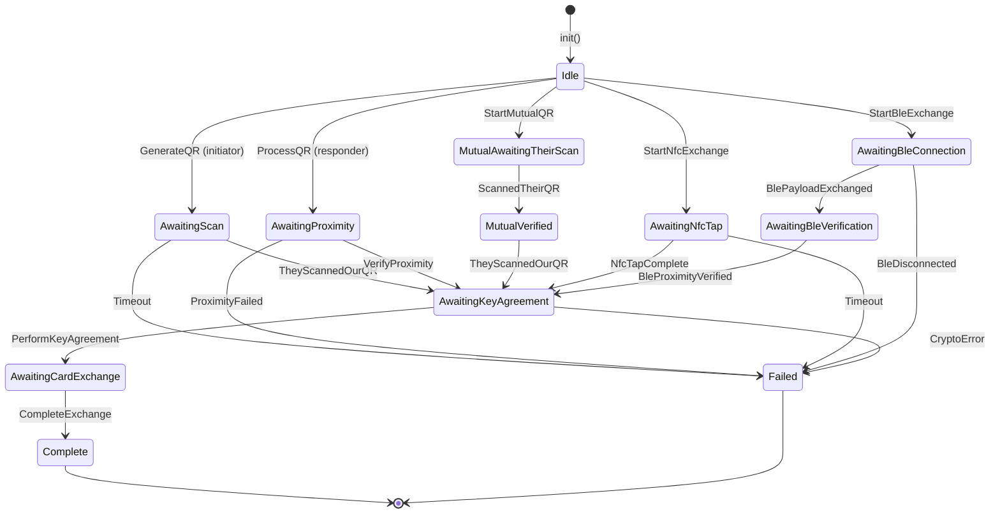
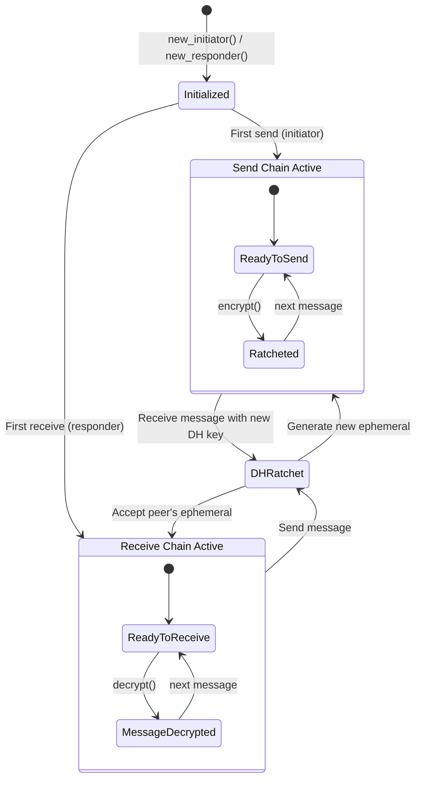
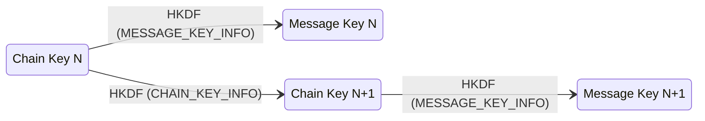
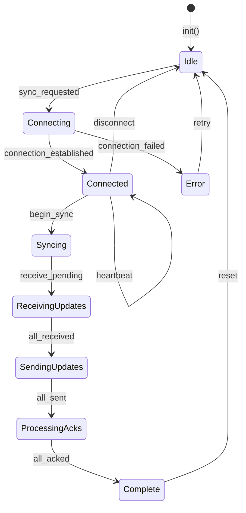
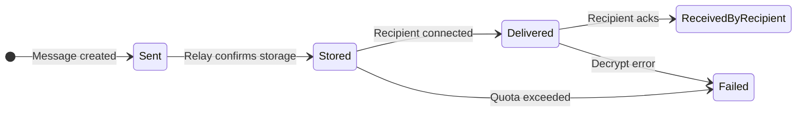
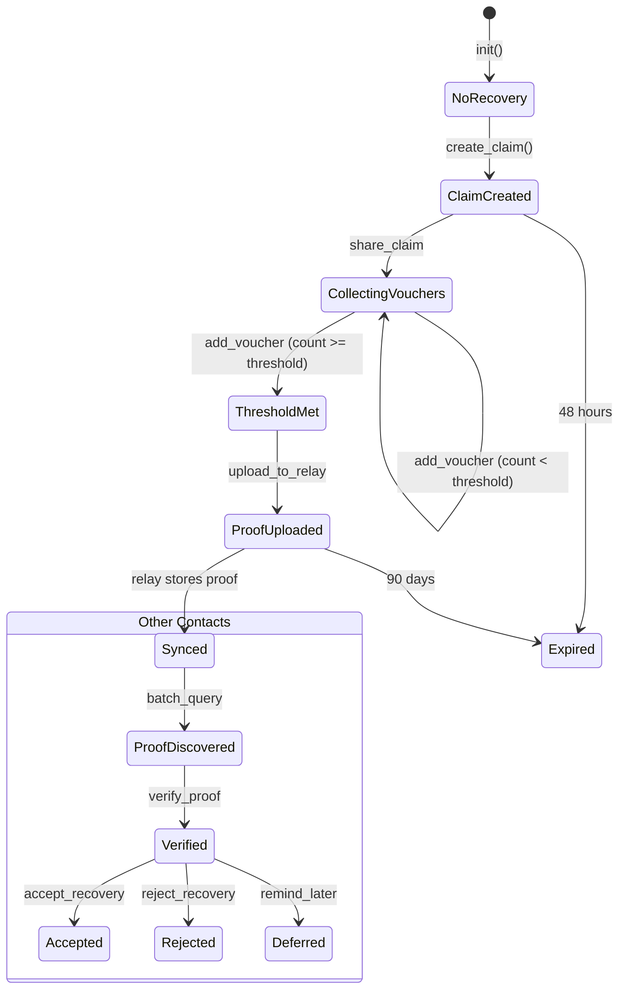
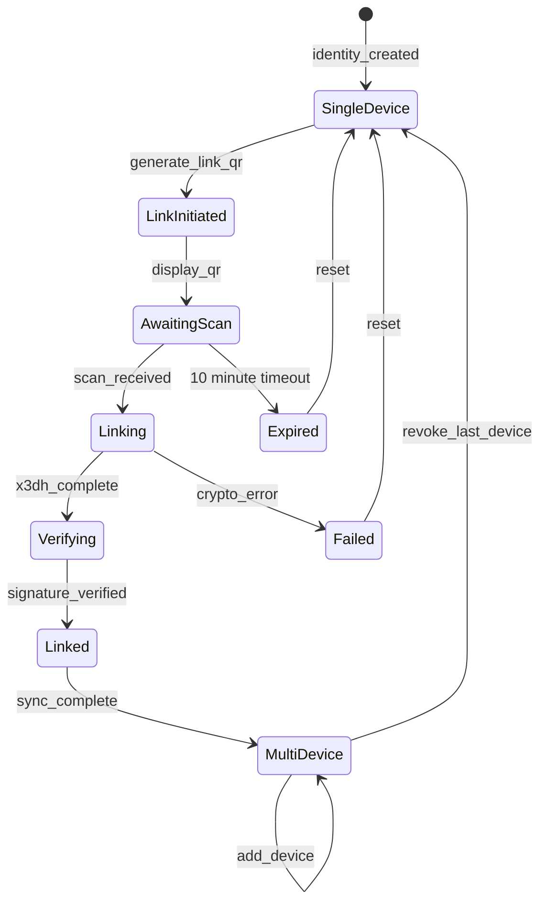
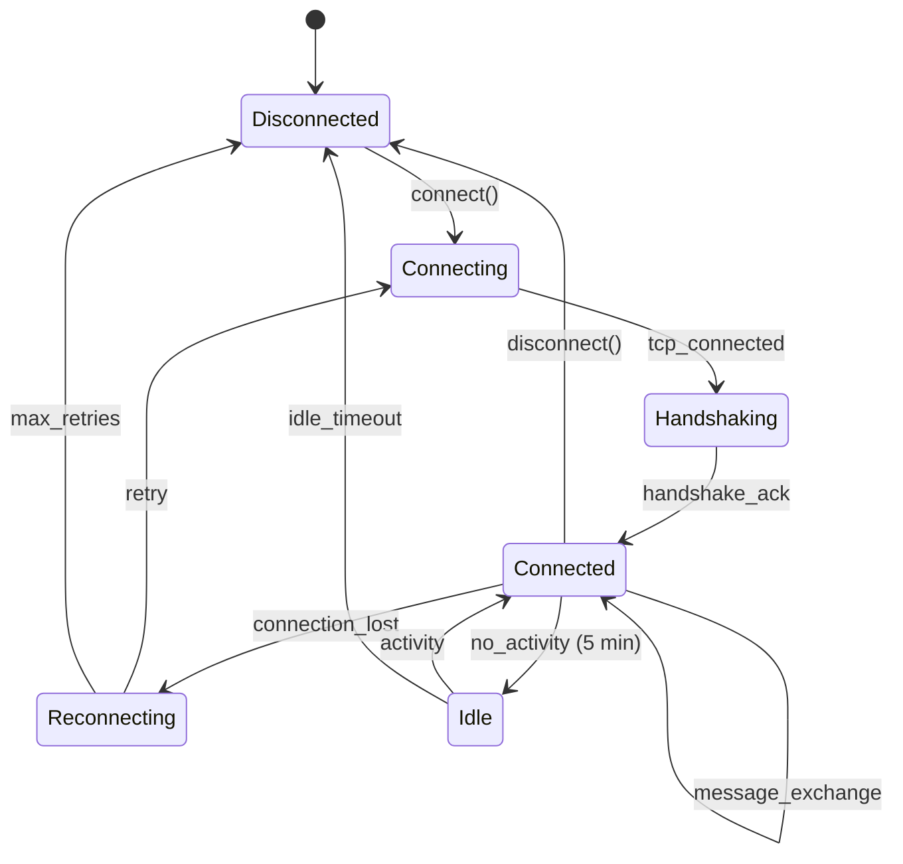

<!-- SPDX-FileCopyrightText: 2026 Mattia Egloff <mattia.egloff@pm.me> -->
<!-- SPDX-License-Identifier: GPL-3.0-or-later -->

# State Machines

This document describes the key state machines in Vauchi.

## Exchange Session

**Location**: `core/vauchi-core/src/exchange/session.rs`

The exchange session manages contact exchange across all transport types (QR, NFC, BLE).



### States

| State | Description | Next Events |
|-------|-------------|-------------|
| `Idle` | Initial state | GenerateQR, ProcessQR, StartMutualQR, StartNfcExchange, StartBleExchange |
| `AwaitingScan` | QR displayed, waiting for peer to scan | TheyScannedOurQR, Timeout |
| `AwaitingProximity` | QR scanned, verifying proximity | VerifyProximity, ProximityFailed |
| `MutualAwaitingTheirScan` | Both sides display QR, waiting to scan peer | ScannedTheirQR |
| `MutualVerified` | Scanned peer's QR, waiting for them to scan ours | TheyScannedOurQR |
| `AwaitingNfcTap` | NFC mode, waiting for tap | NfcTapComplete, Timeout |
| `AwaitingBleConnection` | BLE mode, waiting for GATT connection | BlePayloadExchanged, BleDisconnected |
| `AwaitingBleVerification` | BLE payloads exchanged, verifying proximity | BleProximityVerified |
| `AwaitingKeyAgreement` | Proximity verified, ready for X3DH | PerformKeyAgreement, CryptoError |
| `AwaitingCardExchange` | Keys agreed, exchanging encrypted cards | CompleteExchange |
| `Complete` | Exchange successful, contact created | — |
| `Failed` | Exchange failed with error | — |

### Timeouts

- **Session timeout**: 60 seconds (resumption window)
- **Proximity timeout**: 30 seconds
- **QR expiry**: 5 minutes

---

## Double Ratchet

**Location**: `core/vauchi-core/src/crypto/ratchet.rs`

The Double Ratchet provides forward secrecy for all contact communications.



### Chain Key Ratchet



### Limits

| Limit | Value | Purpose |
|-------|-------|---------|
| Max chain generations | 2000 | Prevent unbounded ratchet |
| Max skipped keys | 1000 | Prevent memory exhaustion |
| DH generation limit | None | Unlimited ratchet steps |

---

## Sync State

**Location**: `core/vauchi-core/src/sync/manager.rs`

The sync manager coordinates card update propagation.



### Sync Operations

| Operation | Direction | Description |
|-----------|-----------|-------------|
| `receive_pending` | Relay → Client | Get messages queued for this identity |
| `send_updates` | Client → Relay | Push encrypted deltas to contacts |
| `process_acks` | Relay → Client | Handle delivery confirmations |

### Delivery States



---

## Recovery State

**Location**: `core/vauchi-core/src/recovery/mod.rs`

Social recovery for lost identities.



### Verification Results

| Result | Criteria | UI Action |
|--------|----------|-----------|
| `HighConfidence` | ≥ 2 mutual contacts vouched | Auto-prompt to accept |
| `MediumConfidence` | 1 mutual contact vouched | Prompt with warning |
| `LowConfidence` | 0 mutual contacts vouched | Strong warning, suggest in-person verify |

---

## Device Link State

**Location**: `core/vauchi-core/src/identity/device_link.rs`

Linking additional devices to an identity.



### Device Registry

Each identity maintains a signed device registry:

```rust
DeviceRegistry {
    devices: Vec<DeviceInfo>,
    version: u64,
    signature: [u8; 64],  // Signed by identity key
}

DeviceInfo {
    device_id: [u8; 16],
    name: String,
    public_key: [u8; 32],
    added_at: u64,
    last_seen: u64,
}
```

---

## Connection State

**Location**: `core/vauchi-core/src/network/connection.rs`

WebSocket connection lifecycle.



### Reconnection Strategy

| Attempt | Delay | Notes |
|---------|-------|-------|
| 1 | 1s | Immediate retry |
| 2 | 2s | Exponential backoff |
| 3 | 4s | |
| 4 | 8s | |
| 5+ | 30s | Cap at 30 seconds |

---

## Related Documentation

- [System Overview](2026-02-06-system-overview.md) — High-level architecture
- [Crypto Reference](2026-02-06-crypto-reference.md) — Cryptographic operations
- [Exchange Protocol](https://gitlab.com/vauchi/private/-/blob/main/docs/architecture/2026-01-22-exchange-protocol.md) — Exchange details (internal)
- [Sequence Diagrams](https://gitlab.com/vauchi/private/-/blob/main/docs/diagrams/README.md) — Interaction flows (internal)
