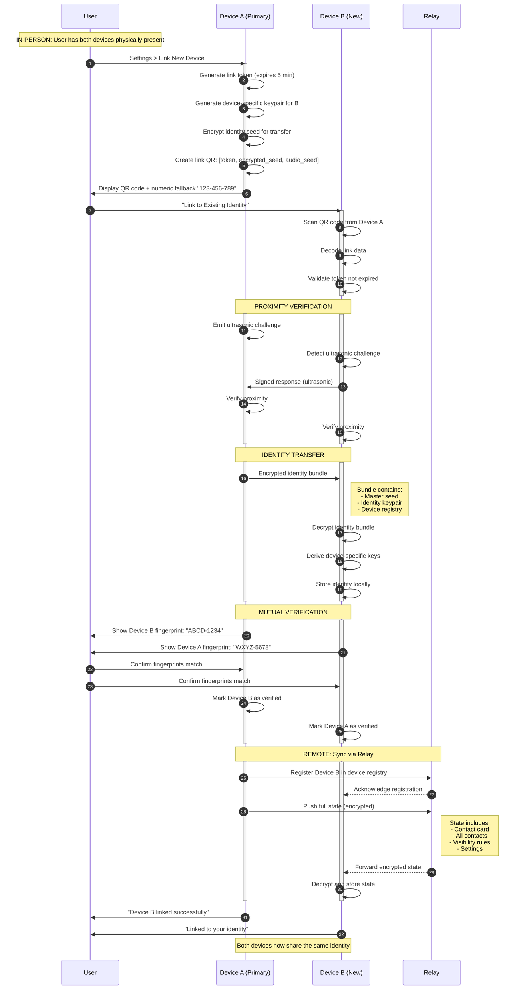
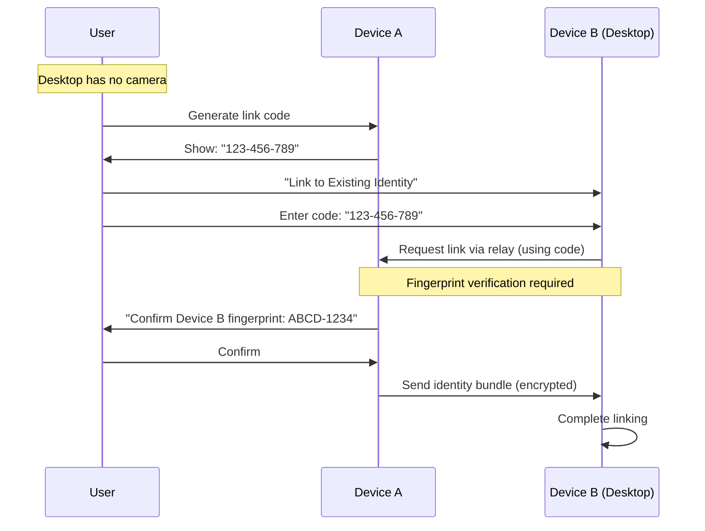
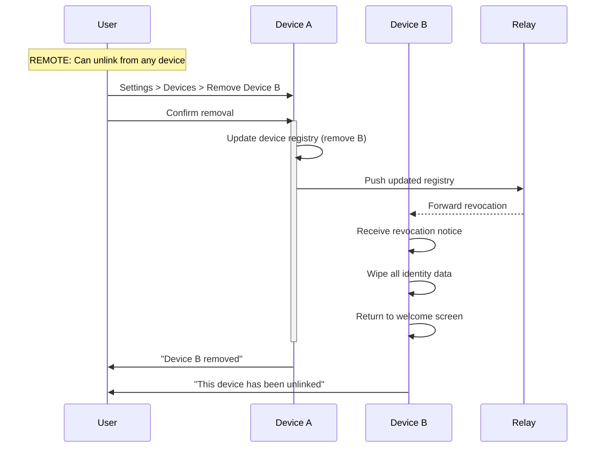

<!-- SPDX-FileCopyrightText: 2026 Mattia Egloff <mattia.egloff@pm.me> -->
<!-- SPDX-License-Identifier: GPL-3.0-or-later -->

# Device Linking Sequence

**Interaction Type:** :handshake: **IN-PERSON (Proximity Required)**

User links a new device to their existing identity. The new device receives the full identity and syncs all data. Proximity verification prevents unauthorized remote linking.

## Participants

- **User** - Person owning both devices
- **Device A (Primary)** - Existing device with identity
- **Device B (New)** - New device to be linked
- **Relay** - WebSocket relay server

## Sequence Diagram



## Data Exchanged

### Link QR Code Contents
```json
{
  "type": "device_link",
  "token": "random 32-byte link token",
  "encrypted_seed": "encrypted master seed",
  "audio_seed": "random seed for proximity check",
  "expires": "timestamp (5 min from creation)",
  "numeric_code": "123-456-789"
}
```

### Identity Bundle (Encrypted)
```json
{
  "master_seed": "32-byte seed for key derivation",
  "identity_keypair": {
    "public": "Ed25519 public key",
    "private": "encrypted Ed25519 private key"
  },
  "device_registry": {
    "version": 2,
    "devices": [
      {"id": "device_a_id", "name": "iPhone", "added": "timestamp"},
      {"id": "device_b_id", "name": "New Device", "added": "timestamp"}
    ]
  }
}
```

## Security Properties

| Property | Mechanism |
|----------|-----------|
| **Proximity Required** | Ultrasonic audio + fingerprint confirmation |
| **Unauthorized Link Prevention** | Token expires in 5 min, proximity verified |
| **Identity Isolation** | Each device has unique device key |
| **Compromise Containment** | Revoking one device doesn't expose others |

## Numeric Code Fallback (No Camera)



## Unlinking a Device



## Related Features

- [Contact Exchange](contact-exchange.md) - Similar proximity verification
- [Sync Updates](sync-updates.md) - How changes sync between linked devices
- [Contact Recovery](contact-recovery.md) - Recovery when all devices lost
