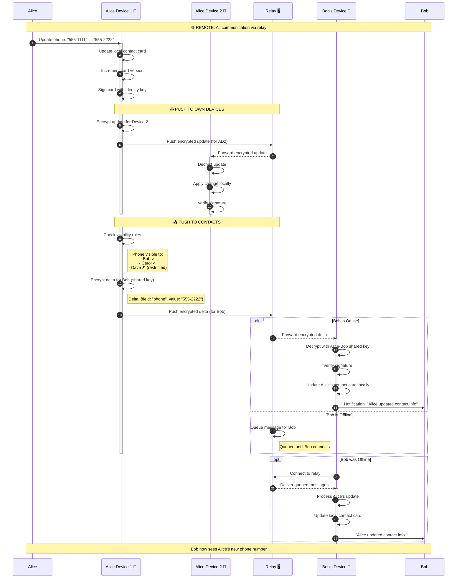
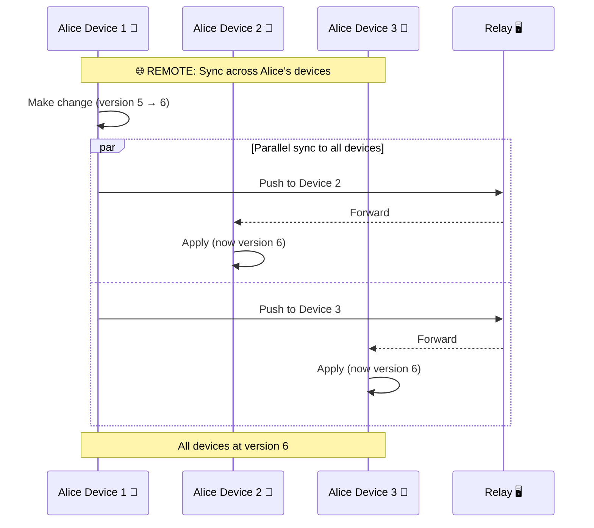
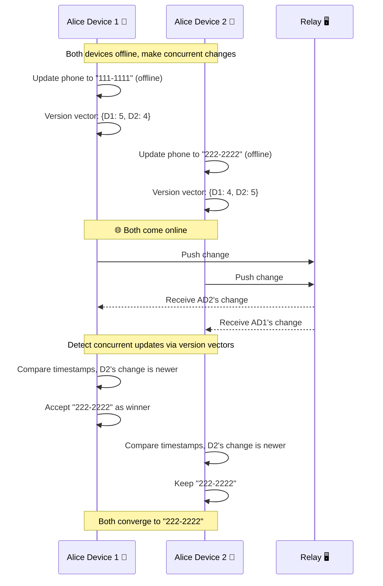
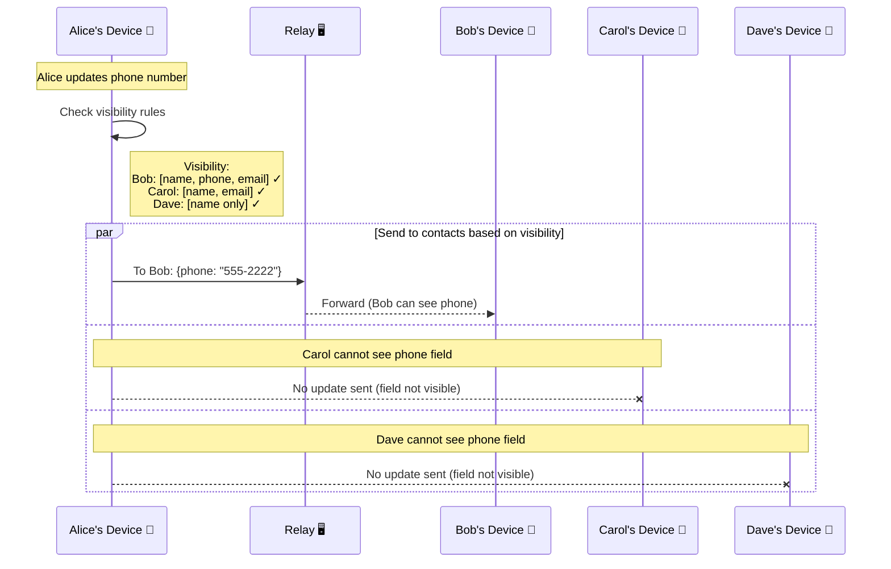
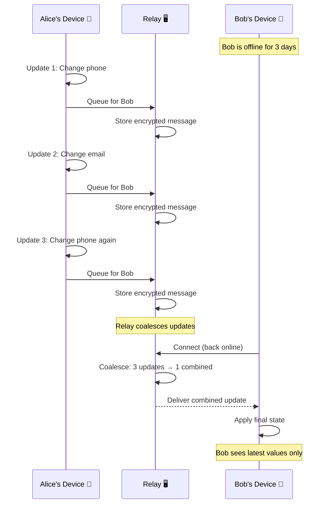

# Sync Updates Sequence

**Interaction Type:** 🌐 **REMOTE (Via Relay)**

Contact card changes propagate automatically to contacts via the relay network. All data is end-to-end encrypted - relays only see encrypted blobs.

## Participants

- **Alice** - User updating their contact card
- **Alice's Device** - Device where change is made
- **Alice's Other Device** - Another linked device
- **Relay** - WebSocket relay server
- **Bob's Device** - Contact receiving the update
- **Bob** - Contact who will see the update

## Sequence Diagram



## Multi-Device Sync Detail



## Conflict Resolution (CRDT)



## Data Exchanged

### Update Delta (Encrypted)
```json
{
  "type": "card_update",
  "from": "Alice's public key",
  "version": 6,
  "timestamp": "2026-01-21T12:00:00Z",
  "changes": [
    {
      "op": "update",
      "path": "/fields/phone",
      "value": "555-2222"
    }
  ],
  "signature": "Ed25519 signature"
}
```

### Sync Status Response
```json
{
  "contact_id": "bob_public_key_hash",
  "status": "synced",
  "last_sync": "2026-01-21T12:00:05Z",
  "pending_updates": 0
}
```

## Visibility-Aware Sync



## Offline Queue Handling



## Security Properties

| Property | Mechanism |
|----------|-----------|
| **End-to-End Encryption** | Updates encrypted with per-contact shared keys |
| **Relay Blindness** | Relay sees only encrypted blobs, no metadata |
| **Update Authenticity** | Ed25519 signature on all updates |
| **Replay Prevention** | Monotonic version numbers + timestamps |
| **Visibility Enforcement** | Only visible fields sent to each contact |

## Related Features

- [Contact Exchange](01-contact-exchange.md) - How shared keys are established
- [Device Linking](02-device-linking.md) - How devices sync with each other
