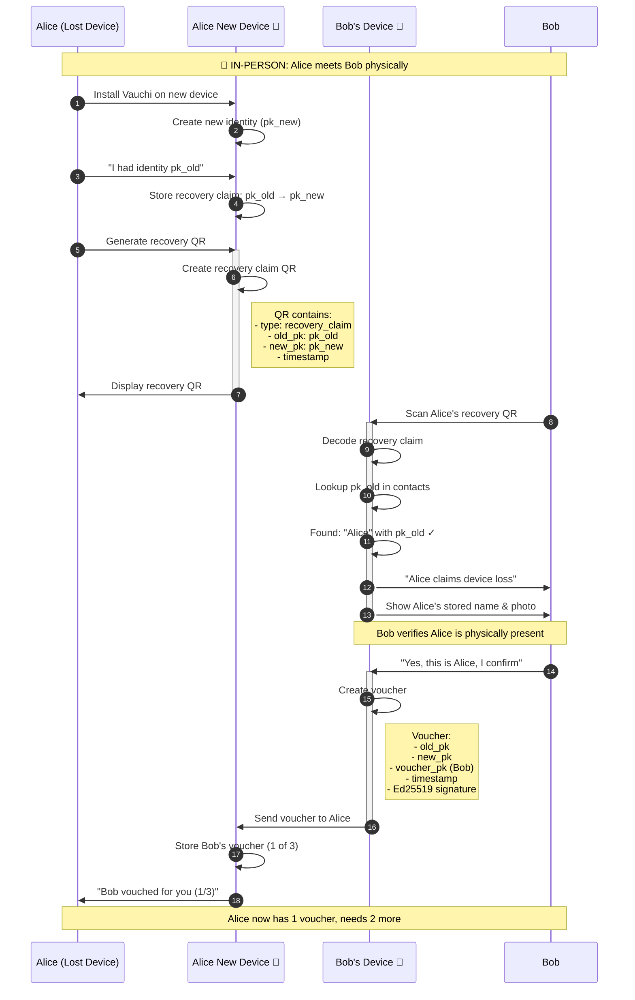
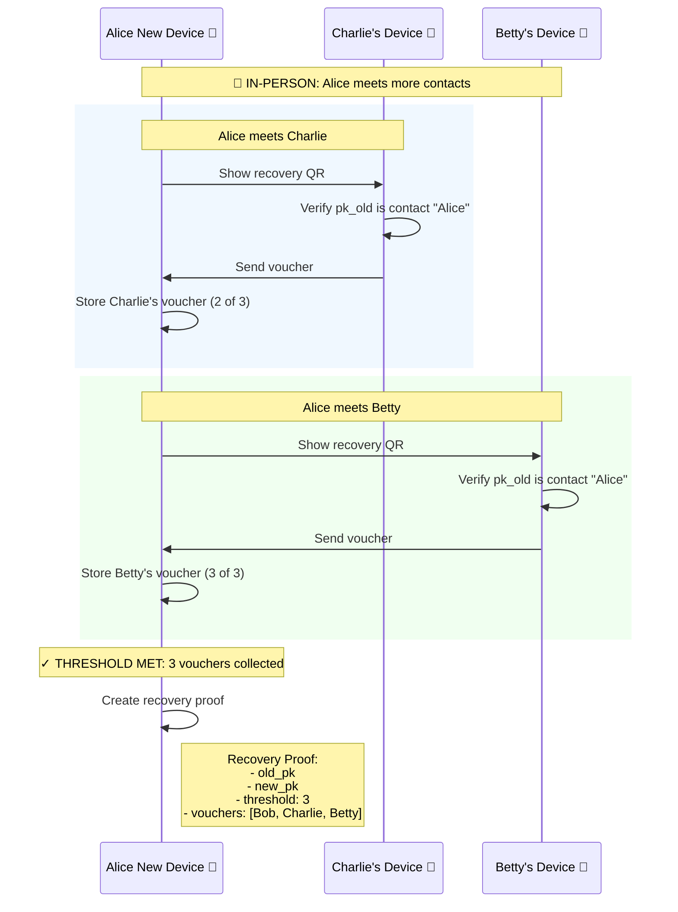
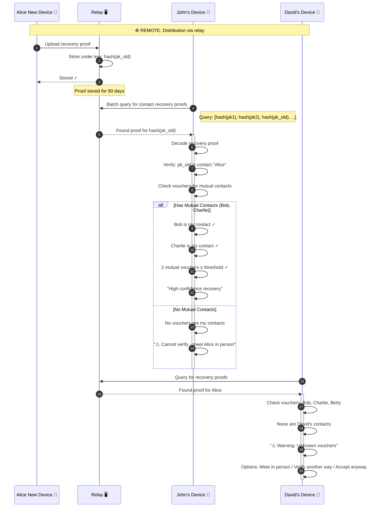
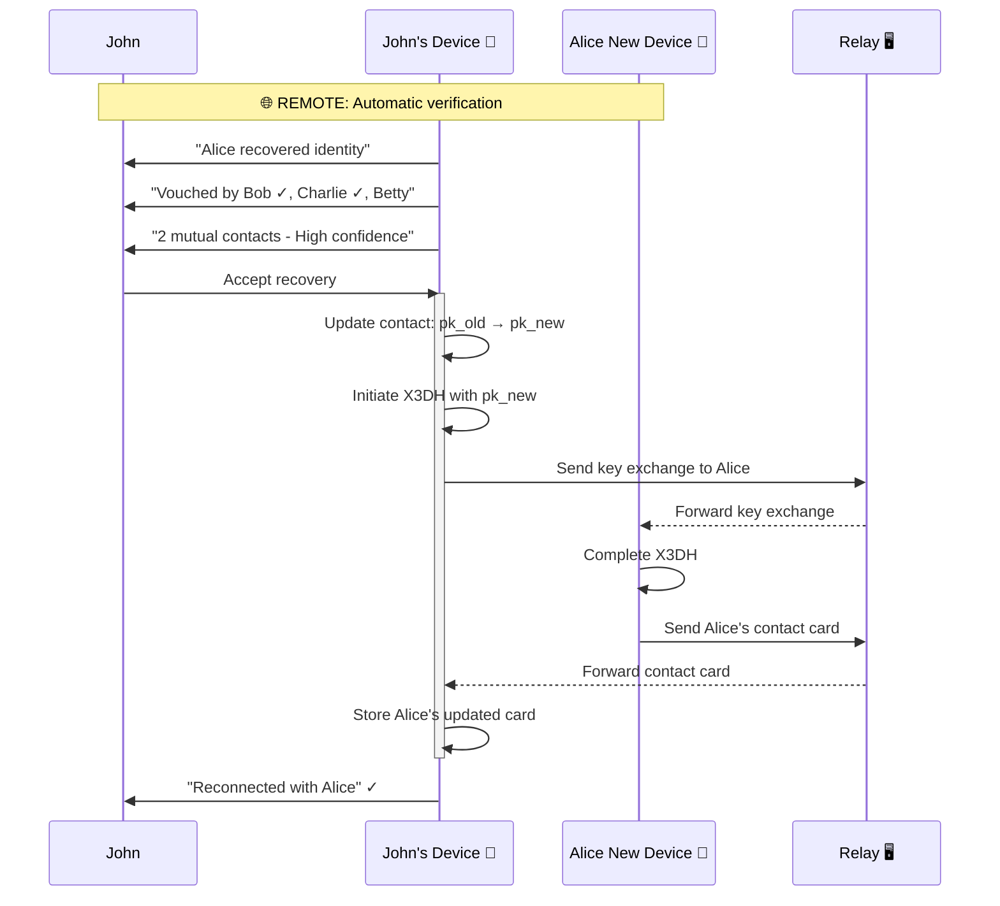
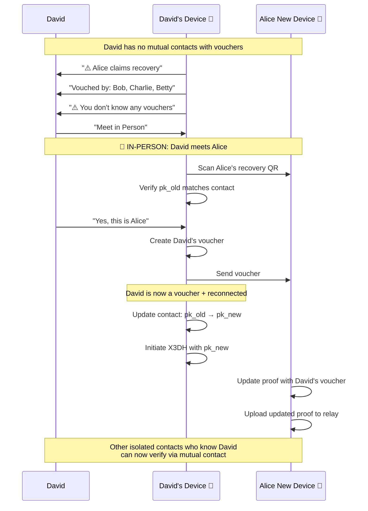
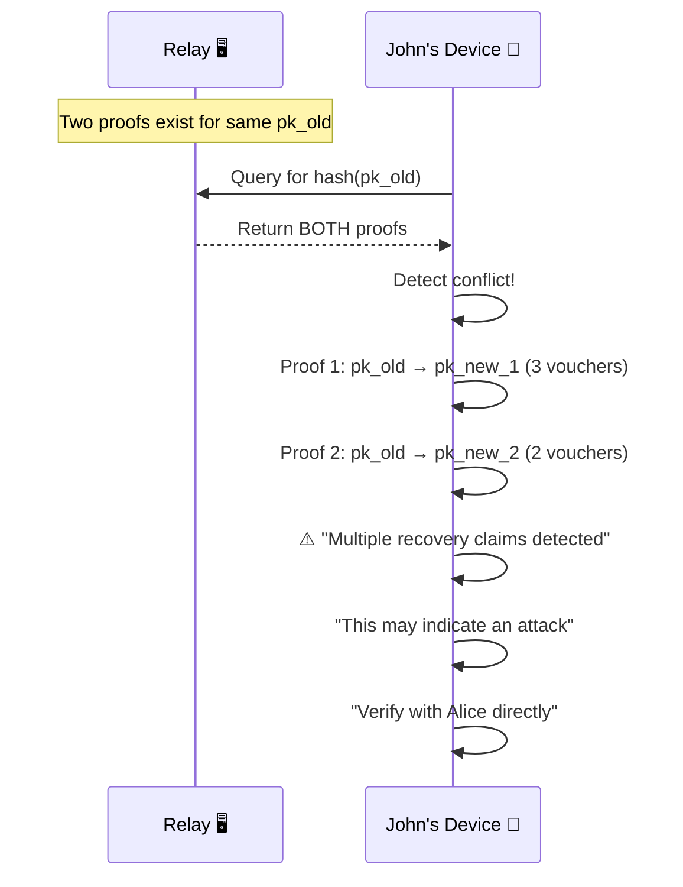

# Contact Recovery Sequence

**Interaction Type:** 🤝 + 🌐 **MIXED (In-Person Vouching + Remote Distribution)**

When a user loses all devices, they can recover their contact relationships through social vouching. Existing contacts vouch for the user in-person, and the recovery proof is distributed remotely via relay.

## Participants

- **Alice** - User who lost their device
- **Alice's New Device** - Fresh install, new identity
- **Bob, Charlie, Betty** - Alice's contacts who will vouch
- **John, David** - Alice's contacts who will receive recovery proof
- **Relay** - WebSocket relay server

## Overview

```
┌────────────────────────────────────────────────────────────────────────────┐
│                         RECOVERY PROCESS                                    │
├────────────────────────────────────────────────────────────────────────────┤
│                                                                            │
│  PHASE 1: Vouching (🤝 In-Person)                                          │
│  ┌─────────┐    ┌─────────┐    ┌─────────┐                                │
│  │   Bob   │    │ Charlie │    │  Betty  │                                │
│  │  Vouch  │    │  Vouch  │    │  Vouch  │                                │
│  └────┬────┘    └────┬────┘    └────┬────┘                                │
│       │              │              │                                      │
│       └──────────────┼──────────────┘                                      │
│                      ▼                                                     │
│              ┌──────────────┐                                              │
│              │ Alice (new)  │  Threshold: 3 vouchers ✓                     │
│              └──────┬───────┘                                              │
│                     │                                                      │
│  PHASE 2: Distribution (🌐 Remote)                                         │
│                     ▼                                                      │
│              ┌──────────────┐                                              │
│              │    Relay     │  Stores proof under hash(pk_old)             │
│              └──────┬───────┘                                              │
│                     │                                                      │
│       ┌─────────────┼─────────────┐                                        │
│       ▼             ▼             ▼                                        │
│  ┌─────────┐   ┌─────────┐   ┌─────────┐                                  │
│  │  John   │   │  David  │   │  Others │  Discover via relay query        │
│  │ Accept  │   │ Verify  │   │         │                                  │
│  └─────────┘   └─────────┘   └─────────┘                                  │
│                                                                            │
└────────────────────────────────────────────────────────────────────────────┘
```

## Phase 1: In-Person Vouching



## Collecting Multiple Vouchers



## Phase 2: Remote Distribution



## John Accepts Recovery (Mutual Contacts)



## David Verifies In-Person (Isolated Contact)



## Data Structures

### Recovery Claim QR
```json
{
  "type": "recovery_claim",
  "old_pk": "Ed25519 public key (lost)",
  "new_pk": "Ed25519 public key (new)",
  "timestamp": "2026-01-21T10:00:00Z"
}
```

### Voucher
```json
{
  "old_pk": "Alice's old public key",
  "new_pk": "Alice's new public key",
  "voucher_pk": "Bob's public key",
  "timestamp": "2026-01-21T10:05:00Z",
  "signature": "Ed25519 signature of above fields"
}
```

### Recovery Proof
```json
{
  "old_pk": "Alice's old public key",
  "new_pk": "Alice's new public key",
  "threshold": 3,
  "vouchers": [
    { /* Bob's voucher */ },
    { /* Charlie's voucher */ },
    { /* Betty's voucher */ }
  ],
  "expires": "2026-04-21T10:00:00Z"
}
```

## Security Properties

| Property | Mechanism |
|----------|-----------|
| **In-Person Vouching** | Vouchers must physically verify the person |
| **Threshold Security** | Requires N vouchers (configurable, default 3) |
| **Mutual Contact Verification** | Recipients verify via contacts they trust |
| **Relay Privacy** | Relay stores proof under hash, learns nothing |
| **Replay Prevention** | Timestamps, signatures, 90-day expiry |
| **Attack Detection** | Conflicting claims trigger warnings |

## Edge Cases

### Conflicting Recovery Claims



## Related Features

- [Contact Exchange](01-contact-exchange.md) - Original key exchange
- [Device Linking](02-device-linking.md) - Recovery not needed if devices linked
- [Sync Updates](03-sync-updates.md) - How reconnected contacts sync
