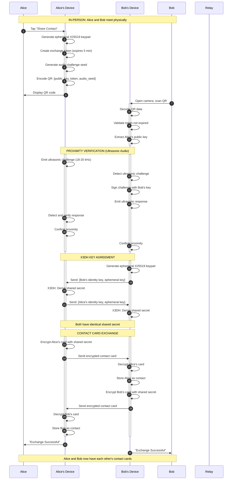
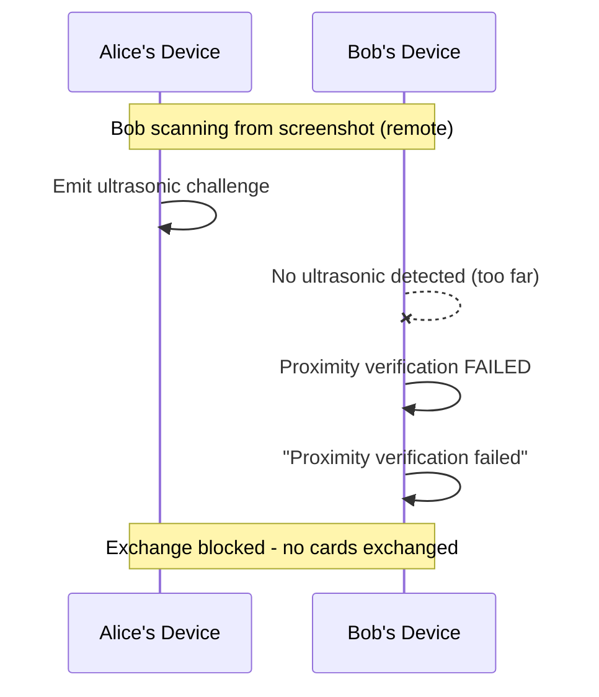
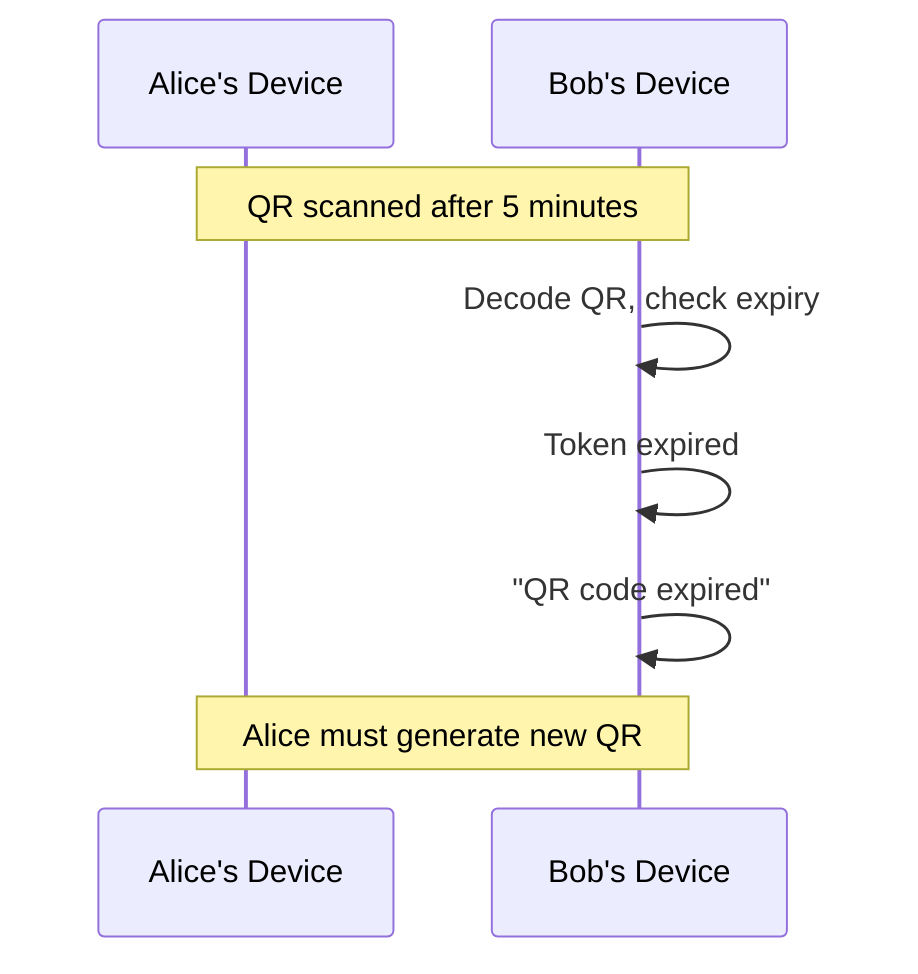

<!-- SPDX-FileCopyrightText: 2026 Mattia Egloff <mattia.egloff@pm.me> -->
<!-- SPDX-License-Identifier: GPL-3.0-or-later -->

# Contact Exchange Sequence

**Interaction Type:** :handshake: **IN-PERSON (Proximity Required)**

Two users exchange contact cards by scanning QR codes while physically present together. Proximity is verified via ultrasonic audio handshake to prevent remote/screenshot attacks.

## Participants

- **Alice** - User initiating exchange (displays QR)
- **Alice's Device** - Mobile/Desktop running Vauchi
- **Bob** - User completing exchange (scans QR)
- **Bob's Device** - Mobile/Desktop running Vauchi
- **Relay** - WebSocket relay server (fallback only)

## Sequence Diagram



## Data Exchanged

### QR Code Contents

```json
{
  "type": "exchange",
  "pk": "base64(Alice's X25519 public key)",
  "token": "random 32-byte exchange token",
  "audio_seed": "random seed for audio challenge",
  "expires": "timestamp (5 min from creation)"
}
```

### Contact Card (Encrypted)

```json
{
  "display_name": "Alice Smith",
  "fields": [
    {"type": "phone", "label": "Mobile", "value": "+1-555-1234"},
    {"type": "email", "label": "Personal", "value": "alice@example.com"}
  ],
  "signature": "Ed25519 signature of card"
}
```

## Security Properties

| Property | Mechanism |
|----------|-----------|
| **Proximity Required** | Ultrasonic audio handshake (18-20 kHz) |
| **No Man-in-the-Middle** | X3DH key agreement with identity keys |
| **Forward Secrecy** | Ephemeral keys discarded after exchange |
| **Replay Prevention** | One-time token, 5-minute expiry |
| **Card Authenticity** | Ed25519 signature on contact card |

## Failure Scenarios

### Proximity Verification Fails



### QR Code Expired



## Platform Variations

| Platform | Proximity Method | Fallback |
|----------|------------------|----------|
| iOS ↔ iOS | Ultrasonic audio | Manual confirmation |
| Android ↔ Android | Ultrasonic audio | Manual confirmation |
| iOS ↔ Android | Ultrasonic audio | Manual confirmation |
| Desktop ↔ Mobile | N/A (no mic) | Manual confirmation required |
| Desktop ↔ Desktop | N/A | Manual confirmation required |

## Related Features

- [Device Linking](device-linking.md) - Similar QR flow for linking devices
- [Sync Updates](sync-updates.md) - How card updates propagate after exchange
