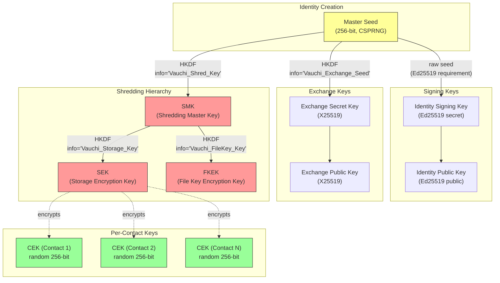
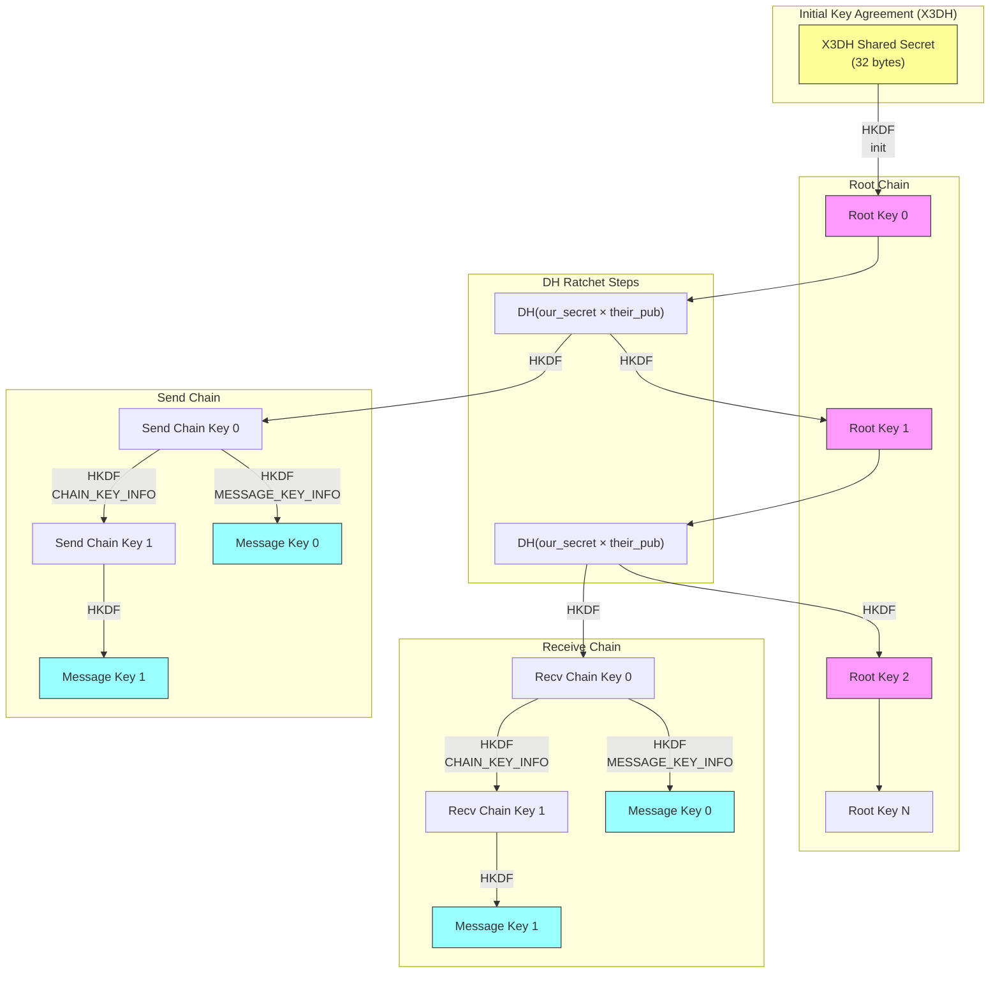
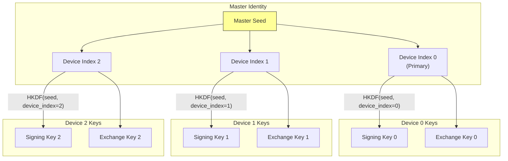
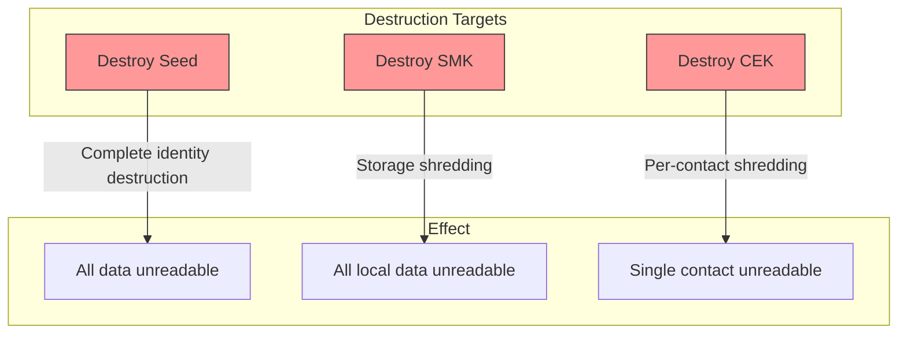
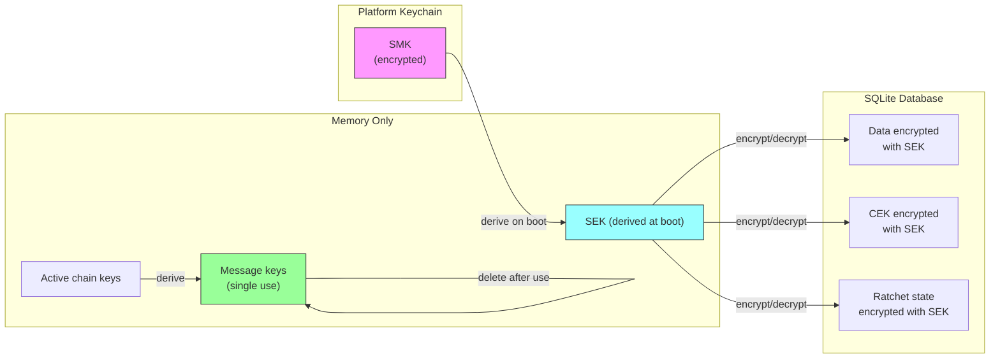
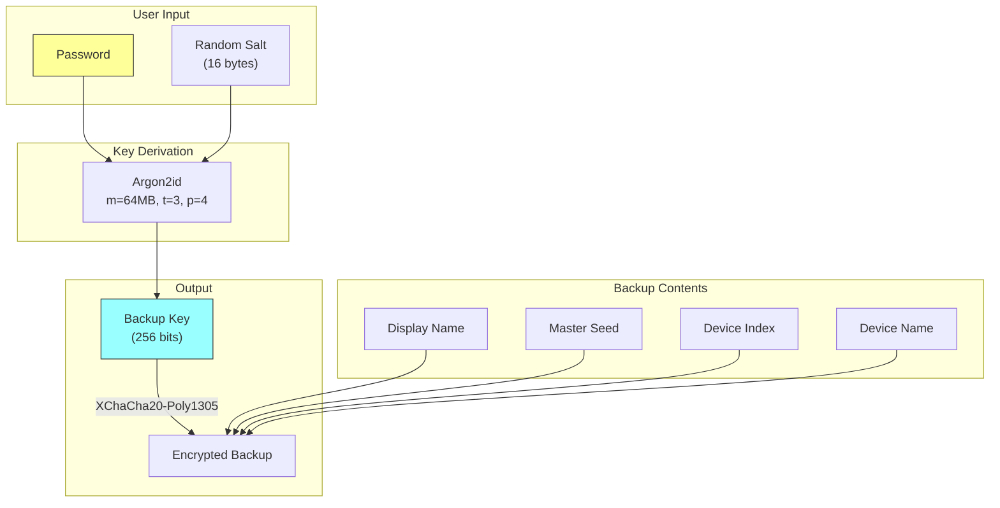

<!-- SPDX-FileCopyrightText: 2026 Mattia Egloff <mattia.egloff@pm.me> -->
<!-- SPDX-License-Identifier: GPL-3.0-or-later -->

# Crypto Key Hierarchy

Visual documentation of Vauchi's cryptographic key hierarchy and derivation paths.

## Master Hierarchy



## Key Derivation Details

### HKDF Convention

All HKDF derivations use standard RFC 5869 (documented as "DP-5"):

```
HKDF-SHA256:
  - salt: None (zeros per RFC 5869 §2.2)
  - ikm: master_seed (32 bytes, high-entropy input)
  - info: domain string (e.g., "Vauchi_Exchange_Seed_v2")
  - output: 32 bytes
```

This follows standard HKDF convention: high-entropy seed as IKM, no salt needed.

### Key Sizes

| Key | Size | Algorithm |
|-----|------|-----------|
| Master Seed | 256 bits | CSPRNG |
| Identity Signing | 32 + 64 bytes | Ed25519 (seed + keypair) |
| Exchange | 32 bytes | X25519 |
| SMK | 256 bits | HKDF-SHA256 |
| SEK | 256 bits | HKDF-SHA256 |
| FKEK | 256 bits | HKDF-SHA256 |
| CEK | 256 bits | CSPRNG |

## Double Ratchet Key Hierarchy



## Device Key Derivation



## Crypto-Shredding Paths



## Key Storage Locations



## Backup Key Derivation



## Security Properties by Key

| Key | Forward Secrecy | Break-in Recovery | Zeroized on Drop |
|-----|-----------------|-------------------|------------------|
| Master Seed | N/A | No | Yes |
| Identity Signing | No | No | Yes |
| Exchange Key | No | No | Yes |
| SMK | No | No | Yes |
| SEK | No | No | Yes (memory only) |
| CEK | Per-contact | N/A | Yes |
| Root Key | Via DH ratchet | Yes | Yes |
| Chain Key | Via symmetric ratchet | N/A | Yes |
| Message Key | Single-use, deleted | N/A | Yes |

## Related Documentation

- [Crypto Reference](../crypto.md) — Algorithm details
- [Architecture Overview](../architecture.md) — System design
- [Message Delivery Flow](message-delivery.md) — Ratchet in action
