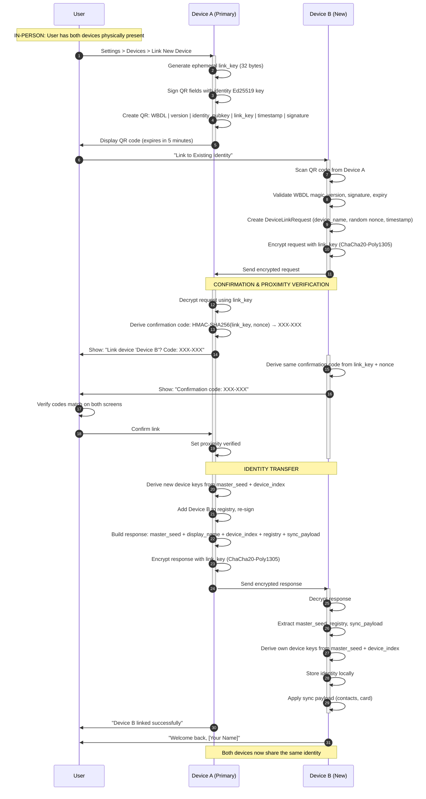
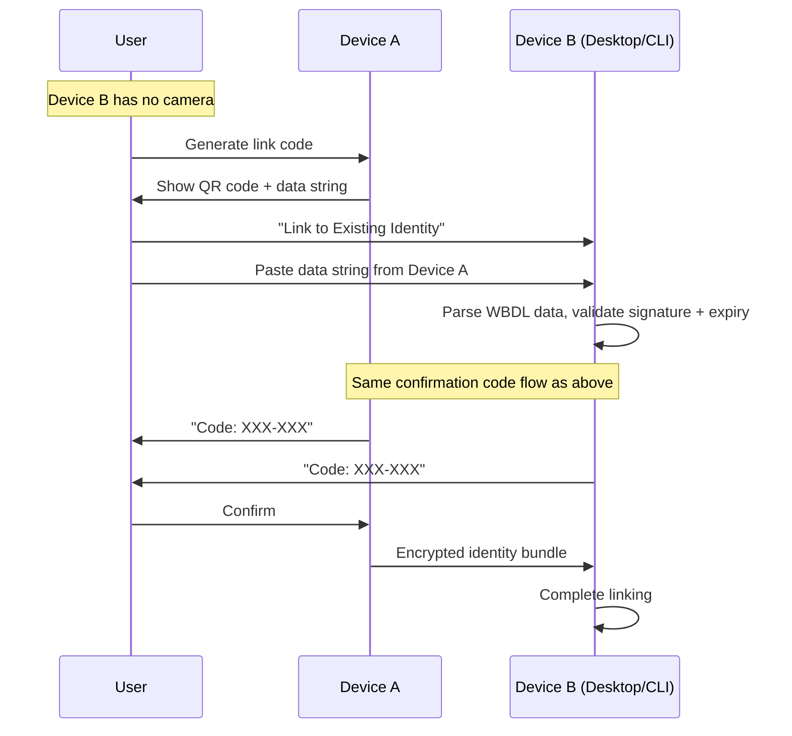
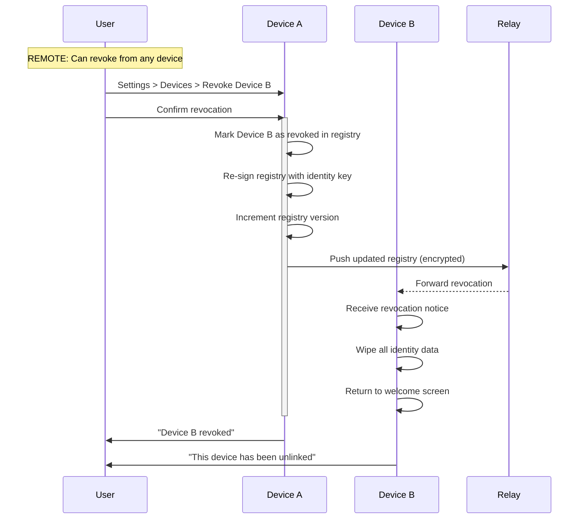

<!-- SPDX-FileCopyrightText: 2026 Mattia Egloff <mattia.egloff@pm.me> -->
<!-- SPDX-License-Identifier: GPL-3.0-or-later -->

# Device Linking Sequence

**Interaction Type:** :handshake: **IN-PERSON (Proximity Required)**

User links a new device to their existing identity. The new device receives the master seed and syncs all data. A confirmation code and proximity verification prevent unauthorized remote linking.

## Participants

- **User** - Person owning both devices
- **Device A (Primary)** - Existing device with identity
- **Device B (New)** - New device to be linked

## Sequence Diagram



## Data Exchanged

### Link QR Code Contents

Binary format with `WBDL` magic bytes, base64-encoded for QR:

```
WBDL              (4 bytes magic)
version           (1 byte, currently 1)
identity_pubkey   (32 bytes, Ed25519 public key)
link_key          (32 bytes, random ephemeral key)
timestamp         (8 bytes, big-endian u64 unix seconds)
signature         (64 bytes, Ed25519 over all preceding fields)
─────────────────
Total: 141 bytes  (before base64 encoding)
```

The QR expires after 300 seconds (5 minutes). Signature is verified by the new device using the embedded identity public key.

### Confirmation Code

Derived independently by both devices:

```
HMAC-SHA256(link_key, request_nonce)
  → first 4 bytes as big-endian u32
  → modulo 1,000,000
  → formatted as XXX-XXX
```

Both devices display the same code. User verifies they match.

### Proximity Challenge

For external proximity verification (NFC, ultrasonic, etc.):

```
HKDF(ikm=link_key, info="vauchi-device-link-proximity-v1", len=16)
  → 16-byte challenge
```

Both devices derive the same challenge from the shared link key.

### DeviceLinkRequest (New → Existing)

Encrypted with ChaCha20-Poly1305 using `link_key`:

```
device_name_len   (4 bytes, little-endian u32)
device_name       (variable, UTF-8)
nonce             (32 bytes, random)
timestamp         (8 bytes, little-endian u64)
```

### DeviceLinkResponse (Existing → New)

Encrypted with ChaCha20-Poly1305 using `link_key`:

```
master_seed       (32 bytes, zeroized after use)
display_name_len  (4 bytes, little-endian u32)
display_name      (variable, UTF-8)
device_index      (4 bytes, little-endian u32)
registry_json_len (4 bytes, little-endian u32)
registry_json     (variable, signed DeviceRegistry)
sync_payload_len  (4 bytes, little-endian u32)
sync_payload_json (variable, contacts + card)
```

## Security Properties

| Property | Mechanism |
|----------|-----------|
| **Seed Encryption** | ChaCha20-Poly1305 with ephemeral link_key |
| **QR Authentication** | Ed25519 signature over QR fields |
| **Confirmation Code** | HMAC-SHA256(link_key, nonce) displayed on both devices |
| **Proximity Verification** | HKDF-derived 16-byte challenge; enforced before confirm |
| **Replay Prevention** | Random 32-byte nonce in each request |
| **Token Expiry** | QR expires after 5 minutes |
| **Registry Integrity** | Ed25519 signature over version + device list |
| **Memory Safety** | Master seed zeroized on Drop |
| **Device Limit** | Maximum 10 devices per identity |

## Numeric Code Fallback (No Camera)



## Revoking a Device



## Platform Implementation Status

| Platform | Status | Notes |
|----------|--------|-------|
| **Core API** | Complete | Full protocol with tests |
| **CLI** | Complete | 7 commands: list, link, join, complete, finish, revoke, info |
| **Desktop (native)** | Complete | Native UI (SwiftUI/GTK/Qt) with QR display, confirmation overlay |
| **TUI** | Complete | ratatui UI with QR overlay, vim-style navigation |
| **iOS** | Planned | Awaiting mobile bindings |
| **Android** | Planned | Awaiting mobile bindings |

## Related Features

- [Contact Exchange](contact-exchange.md) - Similar proximity verification
- [Sync Updates](sync-updates.md) - How changes sync between linked devices
- [Contact Recovery](contact-recovery.md) - Recovery when all devices lost
