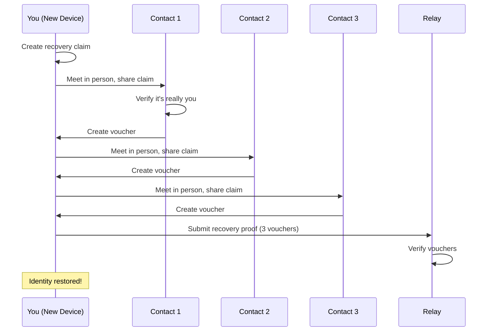

<!-- SPDX-FileCopyrightText: 2026 Mattia Egloff <mattia.egloff@pm.me> -->
<!-- SPDX-License-Identifier: GPL-3.0-or-later -->

# Backup & Recovery

Protect your identity and recover access if something goes wrong.

---

## Overview

Vauchi offers two ways to recover your identity:

| Method | When to Use | Requires |
|--------|-------------|----------|
| **Encrypted Backup** | Planned recovery, new device | Backup code + password |
| **Social Recovery** | Lost all devices and backup | 3+ contacts to vouch for you |

## Encrypted Backup

### Creating a Backup

1. Go to **Settings > Backup**
2. Tap **Export Backup**
3. Enter a strong password (must pass strength check)
4. Confirm the password
5. Copy or save the backup code

!!! important
    - Store your backup code securely (password manager, printed copy)
    - Remember your backup password — it cannot be recovered
    - The backup code + password = your entire identity

### What's Included

| Data | Included? |
|------|-----------|
| Your identity (keys) | Yes |
| Your display name | Yes |
| Device information | Yes |
| Contacts | No* |

*Contact relationships are re-established through the relay when you restore.

### Restoring from Backup

1. Install Vauchi on a new device
2. Choose **Restore from Backup**
3. Paste your backup code
4. Enter your backup password
5. Your identity is restored

After restoration:

- Your identity is fully restored
- Contacts sync automatically via relay
- You can link additional devices

### Backup Security

- **Encryption:** XChaCha20-Poly1305
- **Key derivation:** Argon2id (resistant to brute force)
- **Without the password:** Backup is useless

We recommend passphrases (4+ random words) for memorable yet secure passwords.

## Social Recovery

If you lose access to all devices AND don't have a backup, social recovery lets trusted contacts help restore your identity.

### How It Works

### Starting Recovery

1. Install Vauchi on a new device
2. Create a new identity
3. Go to **Settings > Recovery**
4. Tap **Recover Old Identity**
5. Enter your old public ID
6. A recovery claim is generated

### Getting Vouchers

For each voucher:

1. Meet the contact in person
2. Share your recovery claim with them
3. They verify it's really you (visual recognition)
4. They create a voucher in their app
5. They share the voucher with you

### Requirements

- You need vouchers from **3 or more** contacts
- Each contact must have previously exchanged with your old identity
- This proves your social network recognizes the recovery request

### Completing Recovery

Once you have enough vouchers:

1. Import all vouchers into your app
2. Vauchi submits the recovery proof
3. Other contacts verify via mutual connections
4. Your identity transitions to the new device

## Helping Others Recover

If a contact asks you to vouch for their recovery:

1. Go to **Settings > Recovery**
2. Tap **Help Someone Recover**
3. Paste their recovery claim
4. **Verify their identity** (call them, meet in person)
5. Create a voucher
6. Share the voucher with them

!!! warning
    Only vouch if you're **certain** of their identity. This prevents identity theft.

## Recovery Best Practices

### Before You Need It

1. **Create a backup** as soon as you set up
2. **Store backup securely** (password manager, safe)
3. **Use a memorable passphrase** for the password
4. **Have 5+ contacts** in case some are unavailable

### When You Need It

1. Try backup restore first (faster, simpler)
2. Use social recovery only if backup unavailable
3. Meet contacts in person for vouching
4. Don't rush — verify everything carefully

## Troubleshooting

### Forgot Backup Password

Unfortunately, backup passwords cannot be recovered. The encryption is designed so only you can decrypt your backup. Options:

1. Use social recovery if available
2. Create a new identity and re-exchange with contacts
3. Check if you have another linked device still accessible

### Not Enough Vouchers

If you can't reach 3 contacts:

1. Check if old contacts are still available
2. Wait if contacts are temporarily unavailable
3. Consider creating a new identity as last resort

### Voucher Rejected

Vouchers may be rejected if:

- The voucher is for a different identity
- The voucher is corrupted
- The voucher has expired (90 days)

Ask the contact to create a new voucher.

## Related

- [How to Recover Your Account](../guides/recovery.md) — Step-by-step guide
- [Multi-Device Sync](multi-device.md) — Another way to access your identity
- [Encryption](encryption.md) — How backup encryption works
