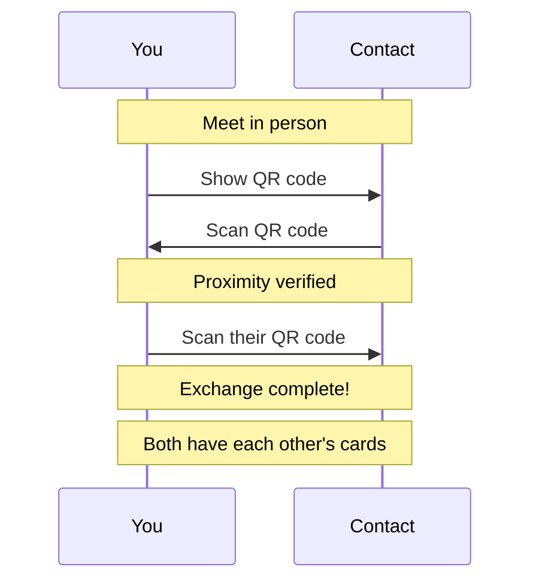

<!-- SPDX-FileCopyrightText: 2026 Mattia Egloff <mattia.egloff@pm.me> -->
<!-- SPDX-License-Identifier: GPL-3.0-or-later -->

# Contact Exchange

Exchange contact cards securely by scanning QR codes in person.

---

## How It Works

Vauchi uses in-person exchange to establish contact relationships. Both parties must be physically present to complete an exchange.

## Why In-Person?

The in-person requirement is a privacy and security feature:

| Threat | How In-Person Prevents It |
|--------|---------------------------|
| Spam | Can't be added by strangers |
| Impersonation | You verify identity yourself |
| Man-in-the-middle | Direct device communication |
| Screenshot attacks | Proximity verification |

## Exchange Methods

### QR Code (Primary)

The main method for exchanging contacts:

1. Open the **Exchange** tab
2. Show your QR code
3. Have the other person scan it
4. Scan their QR code
5. Exchange complete

QR codes expire after 5 minutes for security.

## Proximity Verification

On iOS, Vauchi verifies physical proximity using ultrasonic audio:

- Both phones emit and listen for an audio handshake (18-20 kHz)
- Range: approximately 3 meters
- If verification fails, exchange falls back to manual confirmation
- This prevents screenshot attacks

Android proximity verification is planned.

### Troubleshooting Proximity (iOS)

If proximity verification fails:

1. Ensure both phones have working speakers/microphones
2. Move closer together (within 2-3 meters)
3. Reduce background noise
4. Disable any audio-blocking apps
5. Try again — or confirm manually when prompted

On desktop and CLI/TUI, proximity verification is not available — manual confirmation is required instead.

## After Exchange

Once exchange completes:

- The new contact appears in your **Contacts** list
- You can see their contact card (fields they've shared)
- They can see your contact card (fields you've shared)
- Future updates sync automatically

## Security Properties

| Property | Mechanism |
|----------|-----------|
| Proximity required | Ultrasonic audio handshake (iOS); manual confirmation (other platforms) |
| No man-in-the-middle | X3DH key agreement with identity keys |
| Forward secrecy | Ephemeral keys discarded after exchange |
| Replay prevention | One-time token, 5-minute expiry |
| Card authenticity | Ed25519 signature on contact card |

## Related

- [How to Exchange Contacts](../guides/exchange.md) — Step-by-step guide
- [Privacy Controls](privacy-controls.md) — Control what they see
- [Encryption](encryption.md) — How exchange data is protected
