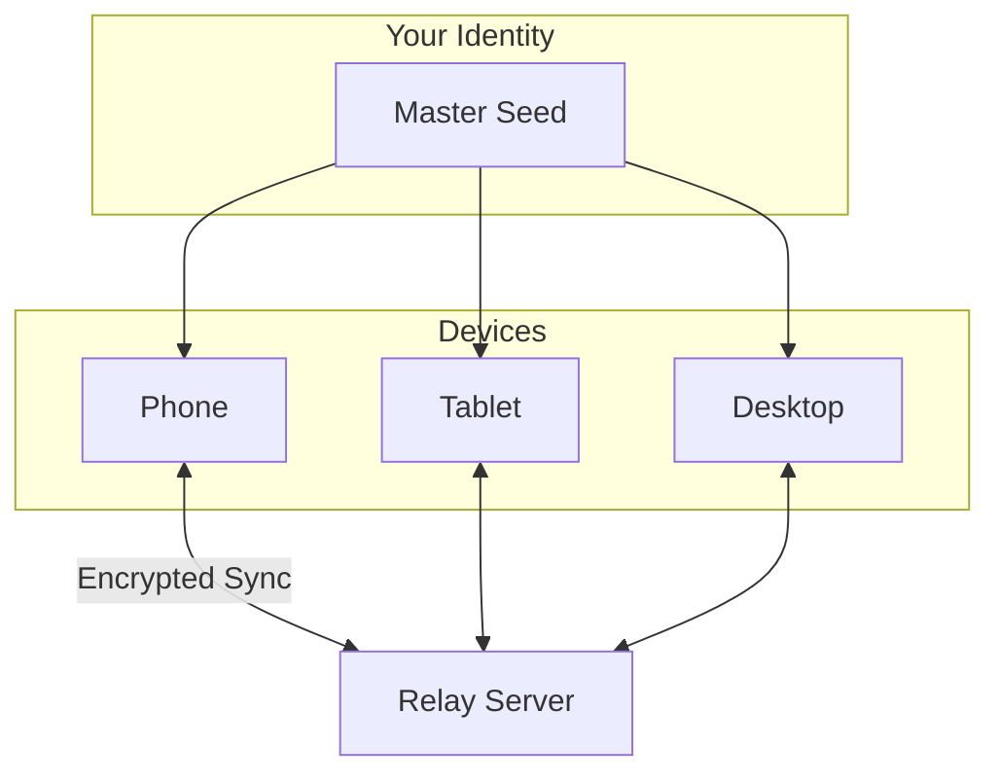

<!-- SPDX-FileCopyrightText: 2026 Mattia Egloff <mattia.egloff@pm.me> -->
<!-- SPDX-License-Identifier: GPL-3.0-or-later -->

# Multi-Device Sync

Use Vauchi on multiple devices with the same identity.

---

## How It Works

All your devices share the same identity and stay in sync. Changes made on one device appear on all others.

## Linking a New Device

### Prerequisites

- Your existing device with Vauchi set up
- The new device with Vauchi installed
- Both devices online

### Steps

1. On your **existing device**, go to **Settings > Devices**
2. Tap **Link New Device**
3. A QR code appears (valid for 5 minutes)
4. On your **new device**, install Vauchi
5. Choose **Join Existing Identity**
6. Scan the QR code from step 3

Both devices now share your identity and sync automatically.

## Device Limits

- **Maximum:** 10 devices per identity
- **Minimum:** 1 device (your primary)

If you need to add an 11th device, revoke an existing one first.

## Managing Devices

### Viewing Linked Devices

1. Go to **Settings > Devices**
2. See all linked devices
3. Your current device is marked

Each device shows:

- Device name
- Platform (iOS, Android, Desktop)
- Last sync time

### Renaming a Device

1. Go to **Settings > Devices**
2. Select a device
3. Tap **Rename**
4. Enter a new name

### Revoking a Device

If a device is lost, stolen, or no longer needed:

1. Go to **Settings > Devices** on another device
2. Find the device to revoke
3. Tap **Revoke**
4. Confirm the action

!!! warning
    You cannot revoke your current device. Use another linked device to revoke a lost one.

A revoked device:

- Loses access to your identity immediately
- Cannot send or receive updates
- Cannot be re-linked without starting fresh

## How Sync Works

- Changes sync automatically when online
- Sync uses end-to-end encryption
- The relay server cannot read your data
- Offline changes sync when connectivity returns

### What Syncs

| Data | Syncs? |
|------|--------|
| Your contact card | Yes |
| Your contacts | Yes |
| Visibility settings | Yes |
| App preferences | Yes |
| Device-specific settings | No |

### Sync Frequency

- **Real-time:** When both devices are online
- **On app open:** Pulls any pending changes
- **Manual:** Pull to refresh or Settings > Sync Now

## Migration

### Moving to a New Phone

**Option 1: Device Linking (Recommended)**

1. On old phone: Link the new phone as a device
2. Wait for sync to complete
3. On old phone: Revoke the old phone (optional)

**Option 2: Backup & Restore**

1. On old phone: Create an encrypted backup
2. On new phone: Restore from backup

Device linking is preferred because it preserves device-specific keys and ensures a clean handoff.

## Troubleshooting

### Sync Not Working

1. Check internet connectivity on both devices
2. Ensure both devices have the app open
3. Try manual sync (Settings > Sync Now)
4. Check that the device hasn't been revoked

### Device Not Appearing

1. Wait a few minutes for sync
2. Restart the app on both devices
3. Check the link code hasn't expired (5 minutes)
4. Try generating a new link code

## Security

- Each device has its own keys derived from your master seed
- Revoking a device invalidates its keys immediately
- The relay server never sees plaintext data
- Device-to-device communication is end-to-end encrypted

## Related

- [How to Set Up Multi-Device](../guides/multi-device.md) — Step-by-step guide
- [Backup & Recovery](backup-recovery.md) — Alternative recovery method
- [Encryption](encryption.md) — How multi-device encryption works
