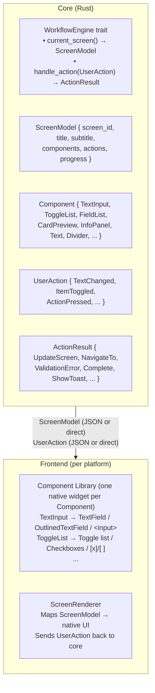
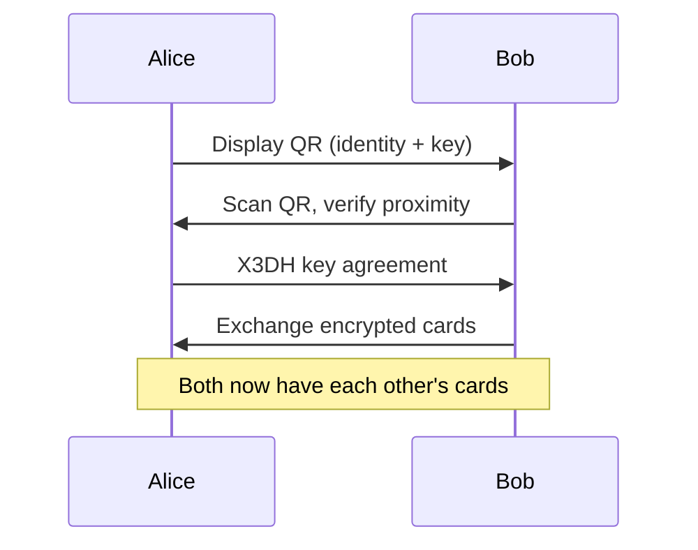
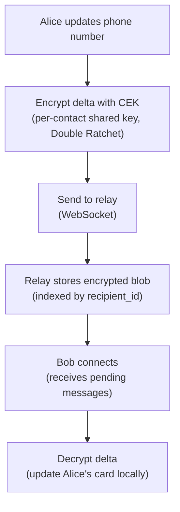
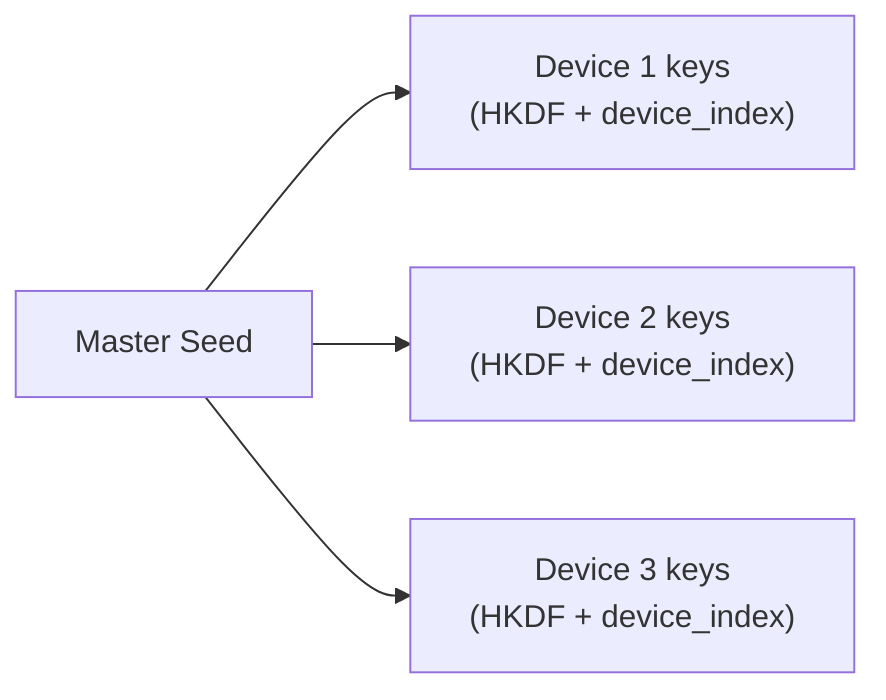
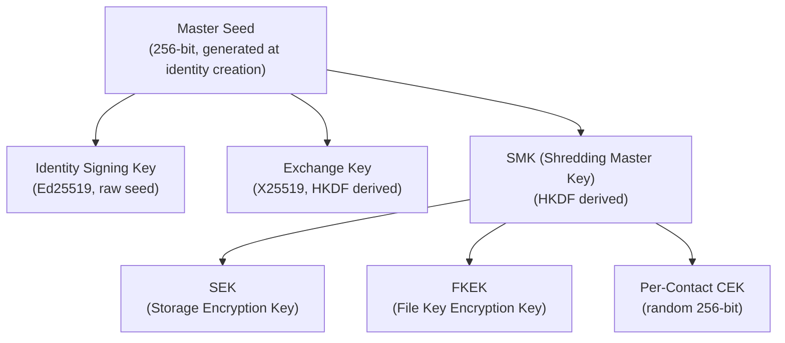

<!-- SPDX-FileCopyrightText: 2026 Mattia Egloff <mattia.egloff@pm.me> -->
<!-- SPDX-License-Identifier: GPL-3.0-or-later -->
<!-- SSOT: Public architecture overview.
     Internal protocol specs: _private/docs/specs/ -->

# Architecture Overview

Vauchi is a privacy-focused contact card system.
Users exchange contact cards in person via QR code
(with NFC and Bluetooth as additional transport
options). After exchange, cards update automatically
— when you change your phone number, everyone who
has your card sees the change.

## System Architecture


> **Note:** All remote client↔relay traffic flows through an OHTTP
> gateway per ADR-037 — the relay never sees client IP addresses, and
> the gateway never sees request content. Sequence diagrams below omit
> the gateway hop for protocol clarity.

## Core Components

### vauchi-core

The Rust core library provides all cryptographic and protocol functionality:

| Module | Purpose | Key Files |
|--------|---------|-----------|
| `crypto/` | Encryption, signing, KDF | `encryption.rs`, `signing.rs` |
| `exchange/` | Contact exchange protocol | `session.rs`, `qr.rs`, `x3dh.rs` |
| `sync/` | Update propagation | `device_sync.rs`, `delta.rs` |
| `recovery/` | Social recovery | `mod.rs` |
| `storage/` | Local encrypted database | `contacts.rs`, `identity.rs` |
| `network/` | Relay communication | `connection.rs`, `protocol.rs` |
| `ui/` | Core-driven UI (`vauchi-app`) | `screen.rs`, `component.rs` |
| `i18n` | Internationalization (`vauchi-app`) | `i18n.rs` |

### vauchi-protocol

Shared protocol message types used by both `vauchi-core` and the relay:

- Serde-only crate (no crypto, no I/O)
- Defines `MessageEnvelope`, `MessagePayload`, and all variant structs
- Provides framing helpers (`encode_message`/`decode_message`)
- Ensures wire format consistency between clients and relay

### Relay Server

Rust server for message routing (depends on `vauchi-protocol` for shared types):

- WebSocket-based store-and-forward
- TLS required in production
- No user accounts — just encrypted blobs
- Background cleanup tasks (hourly)

### Client Applications

| Platform | Stack | Binding |
|----------|-------|---------|
| iOS | SwiftUI | `vauchi-platform-swift` (SPM) |
| Android | Kotlin/Compose | Maven AAR from core CI |
| Linux (GTK) | GTK4 (`gtk4-rs`) | Direct Rust linkage |
| Linux (Qt) | Qt6 (Widgets) | cbindgen C FFI |
| macOS | SwiftUI | UniFFI (shared with iOS) |
| Windows | WinUI3 (C# .NET 8) | C ABI (`vauchi-cabi`) |
| CLI | Rust | Direct library use |
| TUI | Rust (ratatui) | Direct library use |

## Core-Driven UI

Core defines what to show; frontends only decide how
to render natively. New workflows are pure Rust —
zero frontend code unless a new component type is
needed.



Each frontend implements a **component library**
(one native component per `Component` variant) and
a **ScreenRenderer** that maps `ScreenModel` to
native UI. The component library is built once and
reused across all workflows.

| Component | Linux GTK4 | Linux Qt (Widgets) | macOS/iOS (SwiftUI) | Android (Compose) | Windows (WinUI3) | TUI (Ratatui) | CLI |
|-----------|------------|-------------|---------------------|-------------------|-----------------|---------------|-----|
| TextInput | `gtk::Entry` | `TextField` | `TextField` | `OutlinedTextField` | `TextBox` | Input widget | stdin prompt |
| ToggleList | `gtk::CheckButton` | `CheckBox` | List + Toggle | LazyColumn + Checkbox | `ToggleSwitch` | [x]/[ ] list | numbered choice |
| FieldList | `gtk::ListBox` | `ListView` | List + chips | LazyColumn + chips | `ListView` | Table rows | formatted output |
| CardPreview | `gtk::Frame` | `Frame` | Card view | Card composable | `Border` | Box render | text output |
| InfoPanel | `gtk::Box` | `ColumnLayout` | VStack | Column | `StackPanel` | Block | println sections |

**Transport**: Rust clients (CLI, TUI, Desktop)
call `WorkflowEngine` directly. Mobile clients
(iOS, Android) use JSON over UniFFI.

**Adding workflows**: Implement a new
`WorkflowEngine` in core. All frontends render it
automatically via the existing component library —
no frontend changes needed.

**Adding component types**: Define a new `Component`
variant in core, then implement the corresponding
native widget in each frontend's component library.
This is rare — the vocabulary stabilizes quickly.

## Data Flow

### 1. Contact Exchange (In-Person)



### 2. Card Updates (Remote via Relay)



### 3. Multi-Device Sync

All devices under one identity share the same master
seed. Device-specific keys are derived via HKDF:



Device linking uses QR code scan with time-limited token.

### 4. Recovery (Social Vouching)

When all devices are lost:

1. Create new identity
2. Generate recovery claim (old_pk → new_pk)
3. Meet contacts in person, collect signed vouchers
4. When threshold (3) met, upload proof to relay
5. Other contacts discover proof, verify via mutual contacts
6. Accept/reject identity transition

## Security Model

### End-to-End Encryption

- All card data encrypted with XChaCha20-Poly1305
- Per-contact keys derived via X3DH + Double Ratchet
- Forward secrecy: each message uses unique key
- Relay sees only encrypted blobs

### Key Hierarchy



### Physical Verification

Contact exchange requires in-person presence:

- QR + ultrasonic audio verification (18-20 kHz)
  — implemented on iOS, planned for Android
- NFC Active tap (planned — centimeters range)
- BLE with RSSI proximity check (planned — GATT transport)

## Repository Structure

```
vauchi/                    ← Orchestrator repo
├── core/                  ← vauchi-core + vauchi-platform + vauchi-protocol
├── relay/                 ← WebSocket relay server (uses vauchi-protocol)
├── linux-gtk/             ← GTK4 Linux desktop app
├── linux-qt/              ← Qt6 (Widgets) Linux desktop app
├── macos/                 ← macOS native app (SwiftUI)
├── windows/               ← Windows native app (WinUI3)
├── ios/                   ← SwiftUI app
├── android/               ← Kotlin/Compose app
├── cli/                   ← Command-line interface
├── tui/                   ← Terminal UI
├── features/              ← Gherkin specs
├── locales/               ← i18n JSON files
├── ohttp-relay/           ← OHTTP relay proxy
├── themes/                ← Design tokens
├── e2e/                   ← End-to-end tests
└── docs/                  ← Documentation
```

## Related Documentation

- [GUI Guidelines](gui-guidelines.md) — Component
  design rules (toasts, inline editing,
  confirmations)
- [UX Interaction Guidelines](ux-guidelines.md) —
  Interaction philosophy (physical-first,
  local-first, flow design)
- [Crypto Reference](crypto.md) — Cryptographic operations
- [Tech Stack](tech-stack.md) — Technology choices
- [Diagrams](diagrams/index.md) — Sequence diagrams
