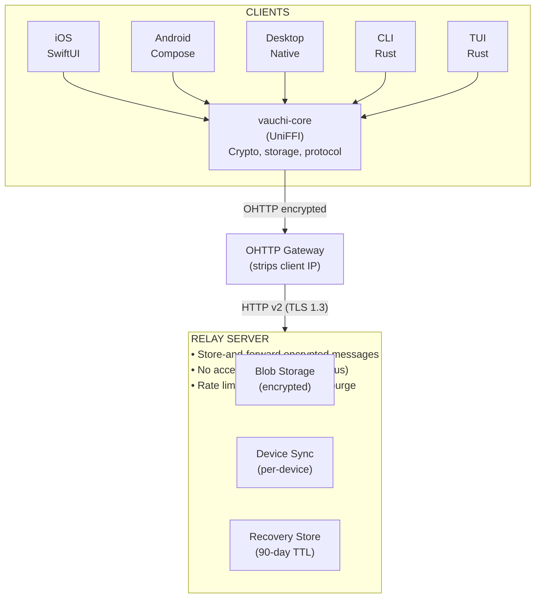
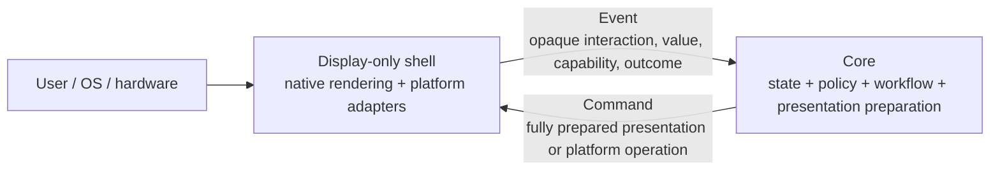
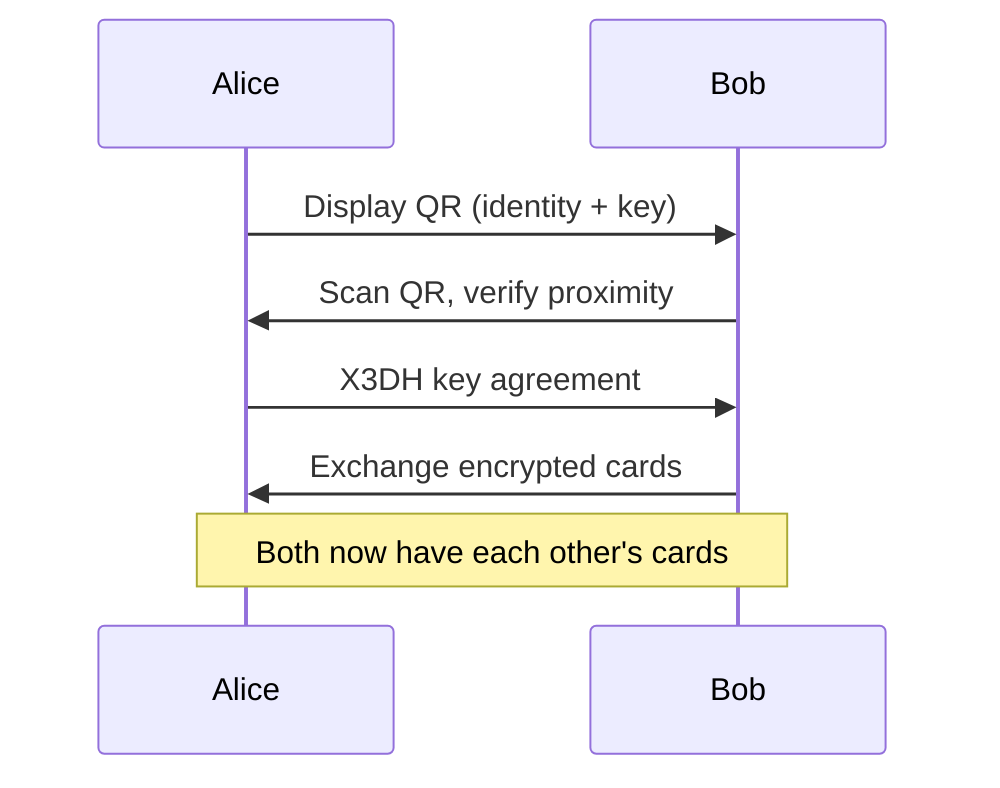
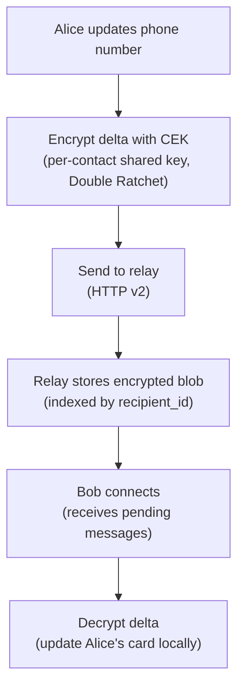
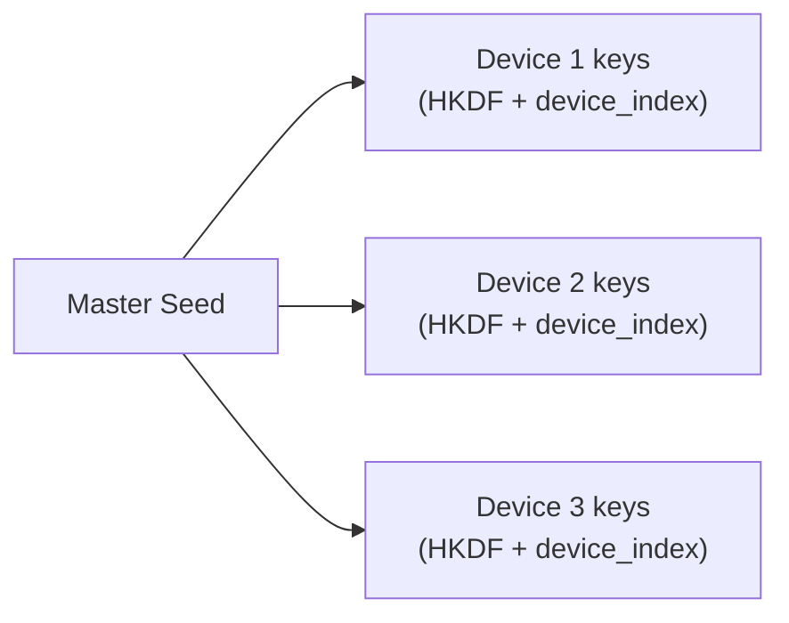
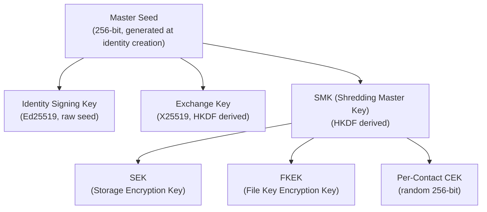

<!-- SPDX-FileCopyrightText: 2026 Mattia Egloff <mattia.egloff@pm.me> -->
<!-- SPDX-License-Identifier: GPL-3.0-or-later -->

# Architecture Overview

Vauchi is a privacy-focused contact card system.
Users exchange contact cards in person via QR code
(with NFC and Bluetooth as additional transport
options). After exchange, cards update automatically
— when you change your phone number, everyone who
has your card sees the change.

## System Architecture



> **Note:** All remote client↔relay traffic flows through an OHTTP
> gateway per ADR-037 — the OHTTP relay sees the client IP but cannot
> decapsulate the request, while the gateway sees the request but only
> the OHTTP relay's IP. End-to-end encryption protects card contents.
> Vauchi currently operates both hops, so this does not yet provide the
> ADR's distinct-operator non-collusion property. Sequence diagrams
> below omit the gateway hop for protocol clarity.

## Core Components

### vauchi-core

The Rust core library provides all cryptographic and protocol functionality:

| Module | Purpose | Key Files |
|--------|---------|-----------|
| [`crypto/`](https://gitlab.com/vauchi/core/-/tree/main/vauchi-core/src/crypto) | Encryption, signing, KDF | `encryption.rs`, `signing.rs` |
| [`exchange/`](https://gitlab.com/vauchi/core/-/tree/main/vauchi-core/src/exchange) | Contact exchange protocol | `session.rs`, `qr.rs`, `x3dh.rs` |
| [`sync/`](https://gitlab.com/vauchi/core/-/tree/main/vauchi-core/src/sync) | Update propagation | `device_sync.rs`, `delta.rs` |
| [`recovery/`](https://gitlab.com/vauchi/core/-/tree/main/vauchi-core/src/recovery) | Social recovery | `mod.rs` |
| [`storage/`](https://gitlab.com/vauchi/core/-/tree/main/vauchi-core/src/storage) | Local encrypted database | `contacts.rs`, `identity.rs` |
| [`network/`](https://gitlab.com/vauchi/core/-/tree/main/vauchi-core/src/network) | Relay communication | `connection.rs`, `protocol.rs` |
| [`ui/`](https://gitlab.com/vauchi/core/-/tree/main/vauchi-app/src/ui) | Core-driven UI (`vauchi-app`) | `screen.rs`, `component.rs` |
| [`i18n`](https://gitlab.com/vauchi/core/-/blob/main/vauchi-app/src/i18n.rs) | Internationalization (`vauchi-app`) | `i18n.rs` |

### vauchi-protocol

Shared protocol message types used by both `vauchi-core` and the relay:

- Serde-only crate (no crypto, no I/O)
- Defines `MessageEnvelope`, `MessagePayload`, and all variant structs
- Provides framing helpers (`encode_message`/`decode_message`)
- Ensures wire format consistency between clients and relay

### Relay Server

Rust server for message routing (depends on `vauchi-protocol` for shared types):

- HTTP v2 store-and-forward (synchronous `/v2/` request/response API)
- TLS required in production
- No user accounts — just encrypted blobs
- Background cleanup tasks (hourly)

### Client Applications

| Platform | Stack | Binding |
|----------|-------|---------|
| iOS | SwiftUI | `vauchi-platform-swift` (SPM) |
| Android | Kotlin/Compose | Maven AAR from core CI |
| Linux (GTK) | GTK4 (`gtk4-rs`) | Direct Rust linkage |
| Linux (Qt) | Qt6 (Widgets) | cbindgen C FFI |
| macOS | SwiftUI | UniFFI (shared with iOS) |
| Windows | WinUI3 (C# .NET 8) | C ABI (`vauchi-cabi`) |
| CLI | Rust | Direct library use |
| TUI | Rust (ratatui) | Direct library use |

## Core-Driven Presentation

Core prepares every user-visible decision. Frontends are display-only shells:
they render or execute generic commands and report opaque events. The same
contract serves GUI, TUI, CLI, and web clients.



`Command` is the only Core-to-shell envelope. Presentation commands use a
small, reusable vocabulary such as text, input, action, list, row, image,
badge, progress, layout, focus, announcement, and dismissal. Core supplies
the copy, accessibility text, enabled and selected state, design tokens,
ordering, and opaque identifiers.

`Event` is the only shell-to-Core envelope. A shell reports that an opaque
action was activated, a bound value changed, a viewport or capability
changed, or a platform operation completed. Core validates the event against
its current state and decides what happens next.

| Primitive | Native GUI | TUI | CLI |
|-----------|------------|-----|-----|
| Text | Native text label | Styled text span | Formatted line |
| Input | Native input control | Input widget | Prompt or argument |
| Action | Native button or menu item | Key or selectable action | Subcommand or numbered choice |
| List / row | Native list and row | Table or list | Repeated formatted records |
| Image | Native image view | Text fallback | Path, bytes, or textual fallback prepared by Core |
| Progress | Native progress control | Gauge or status line | Progress or status output |

Frontends know presentation mechanics and platform APIs, not Vauchi domain
concepts. They do not know whether a row represents a contact, a device, or a
recovery guardian. They do not interpret visibility, trust, exchange,
notification, or navigation categories. Core converts those concepts into
complete generic commands.

Rust clients use the canonical types directly. UniFFI, C ABI, and JSON
consumers use generated representations of the same versioned schema.
Adding or changing a feature requires no frontend change when existing
primitives can express it. A new primitive is a cross-platform contract
change and must describe reusable presentation mechanics rather than a
Vauchi feature.

## Data Flow

### 1. Contact Exchange (In-Person)



### 2. Card Updates (Remote via Relay)



### 3. Multi-Device Sync

All devices under one identity share the same master
seed. Device-specific keys are derived via HKDF:



Device linking uses QR code scan with time-limited token.

### 4. Recovery (Social Vouching)

When all devices are lost:

1. Create new identity
2. Generate recovery claim (old_pk → new_pk)
3. Meet contacts in person, collect signed vouchers
4. When threshold (3) met, upload proof to relay
5. Other contacts discover proof, verify via mutual contacts
6. Accept/reject identity transition

## Security Model

### End-to-End Encryption

- All card data encrypted with XChaCha20-Poly1305
- Per-contact keys derived via X3DH + Double Ratchet
- Forward secrecy: each message uses unique key
- Relay sees only encrypted blobs

### Key Hierarchy



### Physical Verification

Contact exchange requires in-person presence:

- QR + ultrasonic audio verification (18-20 kHz)
  — implemented on iOS, planned for Android
- NFC Active tap (planned — centimeters range)
- BLE with RSSI proximity check (planned — GATT transport)

## Repository Structure

```
vauchi/                    ← Orchestrator repo
├── core/                  ← vauchi-core + vauchi-platform + vauchi-protocol
├── relay/                 ← HTTP v2 relay server (uses vauchi-protocol)
├── linux-gtk/             ← GTK4 Linux desktop app
├── linux-qt/              ← Qt6 (Widgets) Linux desktop app
├── macos/                 ← macOS native app (SwiftUI)
├── windows/               ← Windows native app (WinUI3)
├── ios/                   ← SwiftUI app
├── android/               ← Kotlin/Compose app
├── cli/                   ← Command-line interface
├── tui/                   ← Terminal UI
├── features/              ← Gherkin specs
├── locales/               ← i18n JSON files
├── ohttp-relay/           ← OHTTP relay proxy
├── themes/                ← Design tokens
├── e2e/                   ← End-to-end tests
└── docs/                  ← Documentation
```

## Related Documentation

- [GUI Guidelines](gui-guidelines.md) — Component
  design rules (toasts, inline editing,
  confirmations)
- [UX Interaction Guidelines](ux-guidelines.md) —
  Interaction philosophy (physical-first,
  local-first, flow design)
- [Crypto Reference](crypto.md) — Cryptographic operations
- [Tech Stack](tech-stack.md) — Technology choices
- [Diagrams](diagrams/index.md) — Sequence diagrams
