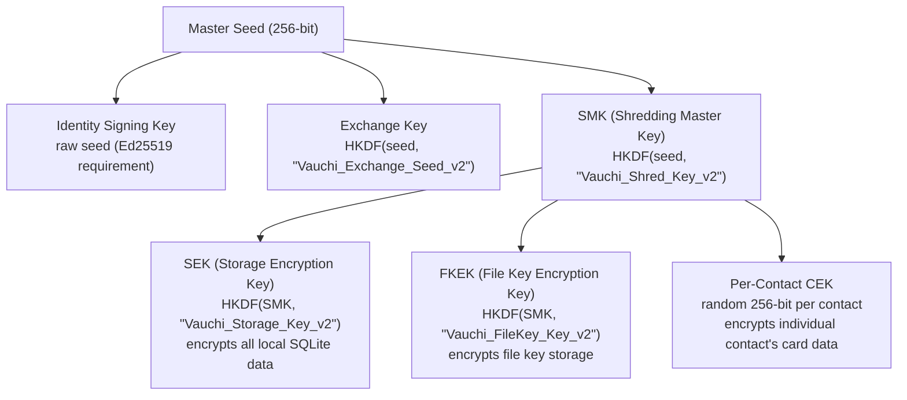
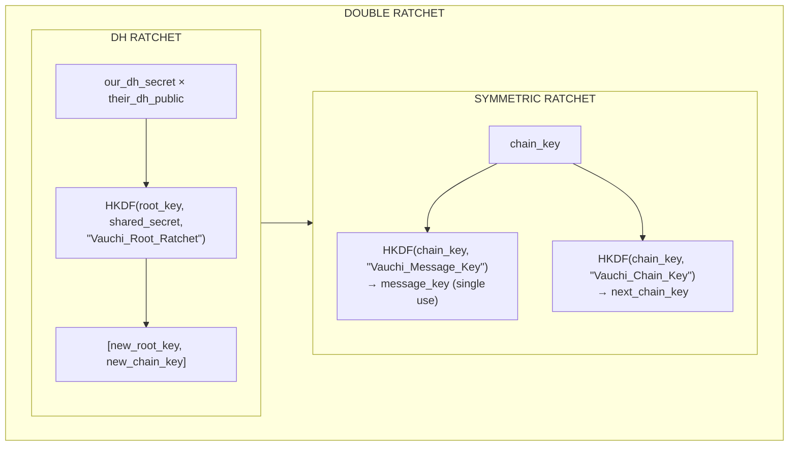

<!-- SPDX-FileCopyrightText: 2026 Mattia Egloff <mattia.egloff@pm.me> -->
<!-- SPDX-License-Identifier: GPL-3.0-or-later -->

# Cryptography Reference

Concise reference for all cryptographic operations in Vauchi.

## Algorithms

| Purpose | Algorithm | Library | Notes |
|---------|-----------|---------|-------|
| **Signing** | Ed25519 | `ed25519-dalek` | Identity, registry |
| **Key Exchange** | X25519 | `x25519-dalek` | X3DH + identity binding |
| **Sym. Encrypt** | XChaCha20-Poly1305 | `chacha20poly1305` | 192-bit nonce |
| **Forward Secrecy** | Double Ratchet | `hkdf` + `hmac` | Chain limit 2000 |
| **Key Derivation** | HKDF-SHA256 | `hkdf` | RFC 5869 |
| **Password KDF** | Argon2id | `argon2` | m=64MB, t=3, p=4 |
| **CSPRNG** | OsRng | `rand` | OS entropy |
| **TLS** | TLS 1.2/1.3 | `rustls` (`aws-lc-rs`) | Relay transport + SPKI pinning |
| **IP Privacy** | OHTTP (RFC 9458) | `ohttp` (`rust-hpke`) | Unlinks client IP from request |

**Post-quantum (planned, ADR-060 / ADR-062).** Key agreement is
classical-only today. A hybrid X25519 + ML-KEM-768 upgrade is planned to
close the
harvest-now-decrypt-later gap on relay-carried ciphertext; signatures
(Ed25519) migrate later since they are not harvest-now-forge-later.

## Key Types

### Identity Keys

| Key | Type | Size | Purpose |
|-----|------|------|---------|
| Master Seed | Symmetric | 256-bit | Root of all keys |
| Signing Key | Ed25519 | 32+64 bytes | Identity, signatures |
| Exchange Key | X25519 | 32 bytes | Key agreement |

### Storage Keys (Shredding Hierarchy)



**HKDF Convention**: Master seed as IKM, no salt,
domain string as info. All derivations use
`HKDF::derive_key(None, &seed, info)`.

**HKDF Context Strings**:

| Context | Usage |
|---------|-------|
| `Vauchi_Exchange_Seed_v2` | Exchange key derivation from master seed |
| `Vauchi_Shred_Key_v2` | SMK derivation from master seed |
| `Vauchi_Storage_Key_v2` | SEK derivation from SMK |
| `Vauchi_FileKey_Key_v2` | FKEK derivation from SMK |
| `vauchi-x3dh-symmetric-v2` | X3DH transcript binding (4-key HKDF info) |
| `vauchi-x3dh-key-v2` | X3DH key agreement derivation |
| `Vauchi_Root_Ratchet` | DH ratchet root key step |
| `Vauchi_Message_Key` | Symmetric ratchet message key |
| `Vauchi_Chain_Key` | Symmetric ratchet chain key advance |
| `Vauchi_AnonymousSender_v2` | Anonymous sender ID derivation |
| `Vauchi_Mailbox_v1` | Contact mailbox token (daily rotation) |
| `Vauchi_DeviceSync` | Device-to-device encryption key derivation |
| `Vauchi_DeviceSync_v1` | Device sync self-token (daily rotation) |

### Ratchet Keys

| Key | Type | Lifecycle |
|-----|------|-----------|
| Root Key | 32 bytes | Updated on DH ratchet |
| Chain Key | 32 bytes | Advances with each message |
| Message Key | 32 bytes | Single-use, deleted after |

## Ciphertext Format

```
algorithm_tag (1 byte) || nonce || ciphertext || tag
```

| Tag | Algorithm | Nonce | Notes |
|-----|-----------|-------|-------|
| `0x01` | AES-256-GCM | 12 bytes | Removed — no longer supported |
| `0x02` | XChaCha20-Poly1305 | 24 bytes | Default since v0.1.2 |
| `0x03` | XChaCha20-Poly1305 + AD | 24 bytes | Double Ratchet (header-bound) |

Tag `0x03` binds message header as AEAD associated
data to prevent relay manipulation.

## Message Padding

All messages padded to fixed buckets before encryption:

| Bucket | Size | Typical Content |
|--------|------|-----------------|
| Small | 256 B | ACK, presence, revocation |
| Medium-Small | 512 B | Short card deltas, single-field updates |
| Medium | 1 KB | Card deltas, small updates |
| Large | 4 KB | Media references, large payloads |

Messages > 4 KB: rounded to next 256-byte boundary.

Format: `[4-byte BE length prefix] [plaintext] [random padding]`

## X3DH Key Agreement

Full X3DH with identity binding (no signed pre-keys):

### QR / Mutual Exchange (Symmetric)

```
Both sides:
  ephemeral ← generate X25519 keypair
  shared_bytes ← DH(our_ephemeral_secret, their_ephemeral_public)

  // Transcript binding: all four public keys sorted lexicographically
  // and appended to info, preventing identity misbinding attacks
  info ← "vauchi-x3dh-symmetric-v2" || sort(id_lo, id_hi) || sort(eph_lo, eph_hi)
  shared ← HKDF(ikm=shared_bytes, salt=None, info=info)
```

### NFC/BLE Exchange

Same as Mutual QR — fresh ephemeral keys on both
sides, HKDF-derived shared secret.

## Double Ratchet



Limits:

- Max chain generations: 2000
- Max skipped keys stored: 1000
- Message key deleted immediately after use

### Ratchet Message (Authenticated, Not Encrypted Header)

```rust
RatchetMessage {
    dh_public: [u8; 32],      // Current DH public key
    dh_generation: u32,       // DH ratchet step counter
    message_index: u32,       // Message index in current chain
    previous_chain_length: u32, // Messages sent in previous chain
    ciphertext: Vec<u8>,      // Encrypted payload
}
```

Header (44 bytes) bound as AEAD associated data (tag `0x03`).

## Backup Format

### v3 — Full Backup (Current)

```
[0x03] || salt(16) || ciphertext
```

- Key derivation: Argon2id (m=64MB, t=3, p=4),
  followed by HKDF-SHA256 with domain separation
  `b"vauchi-backup-v3"`
- Cipher: XChaCha20-Poly1305
- Plaintext: JSON `FullBackupEnvelope`

```text
FullBackupEnvelope {
  version, created_at,
  sections: {
    identity:  { display_name, master_seed_b64, device_index, device_name },
    contacts:  [ ... ],
    own_card:  ContactCard?,     // optional
    labels:    [ LabelSection ]  // optional
  }
}
```

The v3 envelope carries the full account: identity
master seed, contacts, your own card, and labels.
Per-contact Double Ratchet state is **not** included
— it is ephemeral by design and re-established on
the next sync after restore. Source:
`core/vauchi-core/src/backup/full_backup.rs`.

### v2 — Identity-Only (Legacy)

```
[0x02] || salt(16) || ciphertext
```

- Key derivation: Argon2id (m=64MB, t=3, p=4)
- Cipher: XChaCha20-Poly1305
- Plaintext:
  `display_name_len(4) || display_name || master_seed(32) || device_index(4) || device_name_len(4) || device_name`
- **Status:** Superseded by v3. Read path retained
  for migration; new backups are written as v3.

### v1 (Removed)

```
salt(16) || nonce(12) || ciphertext || tag(16)
```

- Key derivation: PBKDF2-HMAC-SHA256
- Cipher: AES-256-GCM
- **Status:** Removed from codebase. Documented for format reference only.

## Transport Encryption

The shipping client (`vauchi-core`) talks to the
relay over the **HTTP v2 protocol**: a synchronous
request/response API (suited to contact-card sync,
not real-time chat), carried over **TLS 1.3** with
SPKI certificate pinning. The WebSocket + Noise
modules were removed from the client in favour of
HTTP v2 (`core/vauchi-core/src/network/mod.rs`:
"websocket and noise modules removed — relay uses
HTTP v2 transport").

### Oblivious HTTP (OHTTP, RFC 9458)

To unlink the client's IP address from its requests,
HTTP v2 requests are encapsulated with **OHTTP** and
relayed through an independent **OHTTP gateway**:

- Gateway key config is fetched from
  `GET /v2/ohttp-key` (`application/ohttp-keys`).
- Each request is encapsulated single-use
  (`OhttpClient::encapsulate`), HPKE-sealed to the
  gateway.
- **ADR-037 requires the gateway operator and the
  relay operator to be distinct entities** — the
  gateway sees the client IP but not the (sealed)
  request; the relay sees the request but only the
  gateway's IP. Neither sees both.

Source: `core/vauchi-core/src/network/http_transport.rs`,
`core/vauchi-core/src/network/ohttp_client.rs`,
`relay/src/ohttp_gateway.rs`.

### Mailbox Routing (Daily-Rotating Tokens)

The relay routes without identities. Messages are
addressed to **daily-rotating mailbox tokens**,
`HKDF(shared_key, day_epoch, "Vauchi_Mailbox_v1")`,
which both parties derive independently for a given
UTC day (`day_epoch = unix_time / 86400`). Clients
register today's and yesterday's tokens to absorb
clock skew. Source:
`core/vauchi-core/src/network/mailbox_token.rs`.

### Noise NK (Removed — Historical)

The original relay transport was a Noise NK inner layer
(`Noise_NK_25519_ChaChaPoly_BLAKE2s`) over WebSocket, as
defense-in-depth inside TLS. It is fully retired: the
shipping client migrated to HTTP v2 + OHTTP (ADR-004,
superseded), and the relay's Noise NK implementation —
the `snow` dependency and the Noise transport — was
deleted. The relay keeps only its X25519 identity
keypair, from which its Ed25519 federation signing key
is derived; no client or relay performs a Noise
handshake. (A residual relay identity public key field
still rides in the discovery payload, unused by clients.)

## Security Properties

| Property | Mechanism |
|----------|-----------|
| **Confidentiality** | XChaCha20-Poly1305 encryption |
| **Integrity** | AEAD authentication tag |
| **Authenticity** | Ed25519 signatures |
| **Forward Secrecy** | Double Ratchet, message keys deleted |
| **Break-in Recovery** | DH ratchet with ephemeral keys |
| **No Nonce Reuse** | Random 24-byte nonces |
| **Memory Safety** | `zeroize` on drop for all keys |
| **Traffic Analysis Prevention** | Standardized bucket-size message padding |
| **Replay Prevention** | Double Ratchet counters |
| **Transport Encryption** | TLS 1.3 + SPKI certificate pinning (HTTP v2) |
| **Network-Location Privacy** | Oblivious HTTP (RFC 9458), independent gateway |
| **Unlinkable Routing** | Daily-rotating mailbox tokens |

## Source Files

| Module | Path |
|--------|------|
| Key Derivation | `core/vauchi-core/src/crypto/kdf.rs` |
| Signing | `core/vauchi-core/src/crypto/signing.rs` |
| Encryption | `core/vauchi-core/src/crypto/encryption.rs` |
| Double Ratchet | `core/vauchi-core/src/crypto/ratchet.rs` |
| Chain Key | `core/vauchi-core/src/crypto/chain.rs` |
| CEK | `core/vauchi-core/src/crypto/cek.rs` |
| Shredding | `core/vauchi-core/src/crypto/shredding.rs` |
| Password KDF | `core/vauchi-core/src/crypto/password_kdf.rs` |
| X3DH | `core/vauchi-core/src/exchange/x3dh.rs` |
| X3DH Session (Symmetric) | `core/vauchi-core/src/exchange/session.rs` |
| Padding | `core/vauchi-core/src/crypto/padding.rs` |

## Related Documentation

- [Architecture Overview](architecture.md) — System design
- [Encryption Feature](../users/features/encryption.md)
  — User-friendly explanation
- [Security](../about/security.md) — Security model overview
