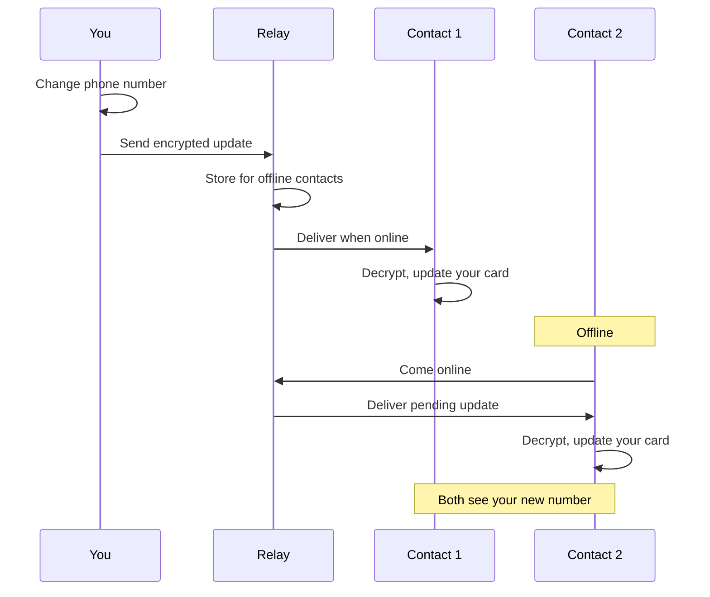

<!-- SPDX-FileCopyrightText: 2026 Mattia Egloff <mattia.egloff@pm.me> -->
<!-- SPDX-License-Identifier: GPL-3.0-or-later -->

# Automatic Updates

Here's a small mystery of human behaviour: people rarely keep their
contact details current, not because they don't care, but because the
effort is all theirs and the benefit is all someone else's. Telling
forty people you've changed your number is a chore; suffering one
person's outdated entry is mildly annoying. So nobody updates anything,
and we all quietly drift out of date.

Vauchi removes the chore entirely. You change your number once, for
yourself, and everyone who holds your card simply has the new one. No
broadcast, no "please update your records," no awkward text six months
later. The address book finally maintains itself.

---

## How it works

## What gets pushed out

| You do this | Your contacts see |
|-------------|-------------------|
| Add a field | It appears (for those allowed to see it) |
| Edit a field | The new value, in place |
| Remove a field | It quietly disappears |
| Change visibility | It appears or vanishes, per person |

## When it lands

**When you're online.** Updates go out in seconds; a contact sees the
change the next time they open the app — near-instant when you're both
active.

**When a contact's offline.** The encrypted update waits on the relay
and is delivered the moment they reconnect. Nothing is lost in the gap.

**If anyone's impatient.** A pull-to-refresh, or **Settings > Sync
Now**, fetches whatever's pending on demand.

## Updates stay private

Every update is end-to-end encrypted, and — crucially — encrypted
*per contact*, which is what lets the same change mean different things
to different people:

| The relay sees | The relay can't see |
|----------------|---------------------|
| An encrypted blob | The field names |
| A rotating routing token | The field values |
| A timestamp | Who you are |
| Padded message size | What actually changed |

### Visibility comes along for the ride

Updates obey your visibility settings automatically. Hide a field from
someone and they never receive its updates; reveal it and they start.
It's all per-contact, never global — which is the whole point:

| Contact | Visibility | What they get |
|---------|------------|---------------|
| Family | Phone visible | Your new number |
| Work | Phone hidden | Nothing at all |
| Friend | Phone visible | Your new number |

You changed one number. Three people got exactly what you'd intend each
of them to have.

## Forward secrecy, even here

Each update rides its own one-time key, derived through the Double
Ratchet. Compromise a single key and you've exposed a single update —
never the history, never the future.

## Troubleshooting

**A contact doesn't see my update.** Check the field is actually visible
to them; check you're online; give it a few seconds; ask them to
refresh.

**Updates feel slow.** Both ends need a connection — confirm theirs as
well as yours. Occasionally the relay has a hiccup. A manual sync
(**Settings > Sync Now**) usually settles it.

**One update seems stuck.** Reopen the app, check connectivity, then
edit and re-save the field to nudge it through.

## Related

- [Privacy Controls](privacy-controls.md) — who sees what
- [Multi-Device Sync](multi-device.md) — updates across your own devices
- [Encryption](encryption.md) — how updates are protected
