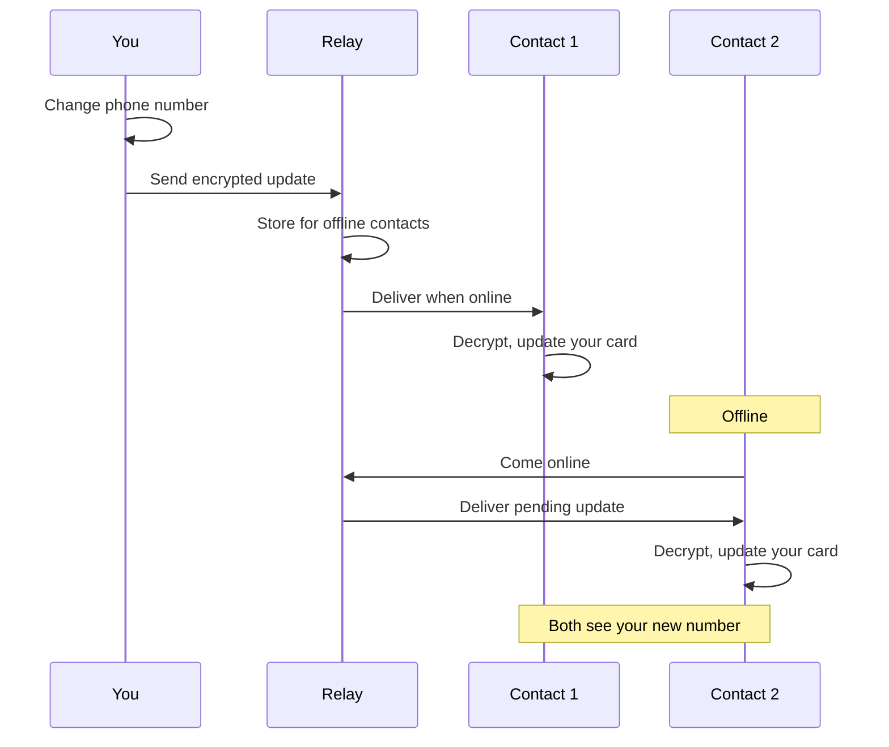

<!-- SPDX-FileCopyrightText: 2026 Mattia Egloff <mattia.egloff@pm.me> -->
<!-- SPDX-License-Identifier: GPL-3.0-or-later -->

# Auto Updates

Your contacts always have your latest information.

---

## How It Works

When you update your contact card, everyone who has
your card automatically sees the change. No need to
send them the new info — it just appears.

## What Updates

When you change your contact card:

| Action | What Happens |
|--------|--------------|
| Add a field | Visible contacts get notified |
| Edit a field | Contacts see the new value |
| Remove a field | Contacts see it disappear |
| Change visibility | Appears/disappears per contact |

## Update Timing

### When Online

- Updates deliver within seconds
- Contacts see changes when they open the app
- Real-time sync when both are active

### When Offline

- Updates queue on the relay server
- Delivered when the contact comes online
- Messages kept for up to 120 days

### Manual Refresh

Contacts can always:

- Pull to refresh their contact list
- Go to Settings > Sync Now

## Privacy of Updates

Updates are end-to-end encrypted:

- The relay server cannot read update content
- Each contact receives updates encrypted with
  their unique key
- Different contacts may see different fields
  (per visibility settings)

### What the Relay Sees

| Sees | Doesn't See |
|------|-------------|
| Encrypted blob | Field names |
| Recipient ID | Field values |
| Timestamp | Who you are |
| Message size (padded) | What changed |

## Visibility and Updates

Updates respect your visibility settings:

- If you hide a field from someone, they don't
  receive updates for it
- If you show a field to someone, they start
  receiving updates
- Changes are per-contact, not global

### Example

You change your phone number:

| Contact | Visibility | What They See |
|---------|------------|---------------|
| Family | Phone visible | New number |
| Work | Phone hidden | Nothing |
| Friend | Phone visible | New number |

## Forward Secrecy

Each update uses a unique encryption key:

- Keys are derived via Double Ratchet
- Even if one key is compromised, other updates
  stay secure
- Past messages can't be decrypted with current keys

## Troubleshooting

### Contact Doesn't See My Update

1. **Check visibility** — Is the field visible to
  them?
2. **Check your connection** — Are you online?
3. **Wait a moment** — Updates may take a few
  seconds
4. **Ask them to refresh** — Pull to refresh or
  manual sync

### Updates Seem Slow

1. **Check both connections** — You and the contact
  need internet
2. **Check relay status** — Rare server issues may
  delay delivery
3. **Try manual sync** — Settings > Sync Now

### Update Stuck

If an update seems stuck:

1. Close and reopen the app
2. Check internet connectivity
3. Try editing and saving the field again

## Related

- [Privacy Controls](privacy-controls.md)
  — Control who sees what
- [Multi-Device Sync](multi-device.md)
  — Updates across your devices
- [Encryption](encryption.md)
  — How updates are protected
