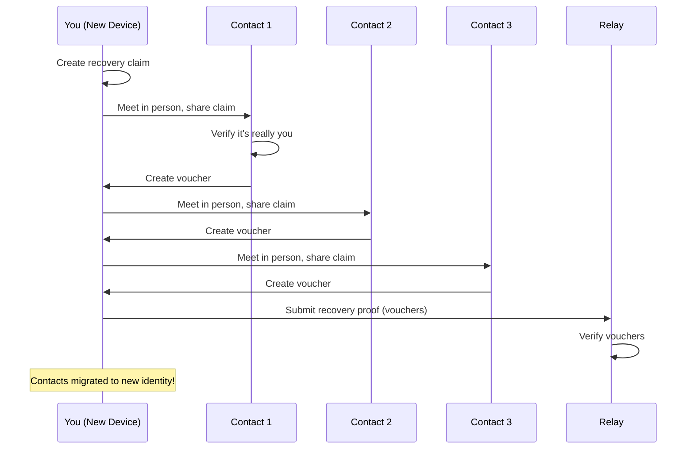

<!-- SPDX-FileCopyrightText: 2026 Mattia Egloff <mattia.egloff@pm.me> -->
<!-- SPDX-License-Identifier: GPL-3.0-or-later -->

# Backup & Recovery

Because your device is your account, losing it would matter — so Vauchi
gives you two quite different safety nets, and they're at their best when
you set them up *before* you need them. A backup is the five-minute
insurance policy you'll be grateful for on a bad day. Social recovery is
the same trick humans have always used when documents fail: people who
know you, vouching that you're you.

| Method | When it's for | What it needs |
|--------|---------------|---------------|
| **Encrypted backup** | A planned safety net | Your backup file + password |
| **Social recovery** | Every device lost, no backup | A few trusted contacts to vouch |

---

## Encrypted backup

### Make one

1. Go to **Settings > Backup**
2. Tap **Export Backup**
3. Choose a strong password (it must pass the strength check)
4. Confirm it
5. Save the backup file somewhere safe

```admonish important
- Keep the backup file somewhere you'll find it (a password manager, a
  printed copy in a drawer).
- Memorise the password — it genuinely cannot be recovered.
- Backup file **plus** password equals your whole account. Guard them
  the way you'd guard the two halves of a safe combination.
```

### What's inside

A full backup is exactly that — a complete copy of your account:

| Data | Included? |
|------|-----------|
| Your identity (the master seed your keys grow from) | Yes |
| Your contacts | Yes |
| Your own card | Yes |
| Your labels and groups | Yes |
| Per-conversation forward-secrecy keys | No* |

\*Those short-lived keys are *meant* to be disposable — that's what
gives you forward secrecy. After you restore, each secure channel simply
re-establishes itself the next time you and a contact sync. You get your
people back without dragging yesterday's throwaway keys along.

### Restore from it

1. Install Vauchi on the new device
2. Choose **Restore from Backup**
3. Provide your backup file
4. Enter your password
5. You're back

Your identity, contacts, card, and labels return intact, and secure
channels re-form on the next sync.

### How the backup is protected

- **Encryption:** XChaCha20-Poly1305
- **Key stretch:** Argon2id — deliberately slow and memory-hungry, so
  guessing the password is expensive even with serious hardware
- **Without the password:** the file is meaningless noise

Reach for a passphrase, not a password: a handful of ordinary words
strung together is both easier to remember and harder to crack than the
clever tangle of symbols you'll have forgotten by Tuesday.

## Social recovery

Lost every device *and* have no backup? This is the net beneath the net.
Trusted contacts confirm your identity and migrate your contacts to a
fresh one.

### How it works



It guards both doors at once: you can't be locked out (your friends can
let you in), and an impostor can't walk in (they'd have to fool several
of your friends, in person, at once).

### Start recovery

1. Install Vauchi on the new device
2. Create a new identity
3. Go to **Settings > Recovery**
4. Tap **Recover Old Identity**
5. Enter your old public ID
6. A recovery claim is generated

### Collect vouchers

For each one:

1. Meet the contact in person
2. Share your recovery claim
3. They confirm it's really you (they're looking right at you)
4. They create a voucher
5. They send it to you

### What it takes

- Vouchers from a small threshold of contacts (a handful, by default)
- Each must have previously exchanged with your old identity
- Together they prove your real social network recognises the request

### Finish

1. Import the vouchers
2. Vauchi submits the recovery proof
3. The network verifies through mutual connections
4. Your identity settles onto the new device

Social recovery mints a *new* cryptographic identity — your old signing
keys stay lost, and a few settings (like per-contact visibility) may
need re-tuning. You keep your people; you replace the lock.

## Vouching for someone else

If a contact asks you to vouch:

1. Go to **Settings > Recovery**
2. Tap **Help Someone Recover**
3. Paste their recovery claim
4. **Verify it's really them** — call them, or meet in person
5. Create a voucher
6. Send it over

```admonish warning
Only vouch when you are **certain** who you're vouching for. The whole
defence against identity theft is that you check. A careless voucher is
the one an attacker is counting on.
```

## Good habits

**Before you ever need it:** make a backup the day you set up; store it
somewhere safe; use a memorable passphrase; and keep enough trusted
contacts (five or so) that a couple being unreachable won't sink you.

**When the day comes:** try backup restore first — it's faster and
simpler. Fall back to social recovery only if you must, do the vouching
in person, and don't rush. Verifying carefully is the point, not the
obstacle.

## Troubleshooting

**Forgot the backup password.** It can't be recovered — that's the
guarantee working as designed. Fall back to social recovery, or to
another linked device if you still have one; failing both, start a new
identity and re-exchange.

**Can't reach enough contacts.** See who's still reachable, give it a
little time if some are temporarily away, and treat a new identity as the
last resort.

**A voucher was rejected.** Usually it's for the wrong identity,
corrupted, or tied to an expired recovery claim (claims are valid for
48 hours; an assembled proof lasts 90 days). Ask the contact to issue
a fresh one.

## Related

- [How to Recover Your Account](../guides/recovery.md) — step by step
- [Multi-Device Sync](multi-device.md) — the other way back in
- [Encryption](encryption.md) — how backups are protected
