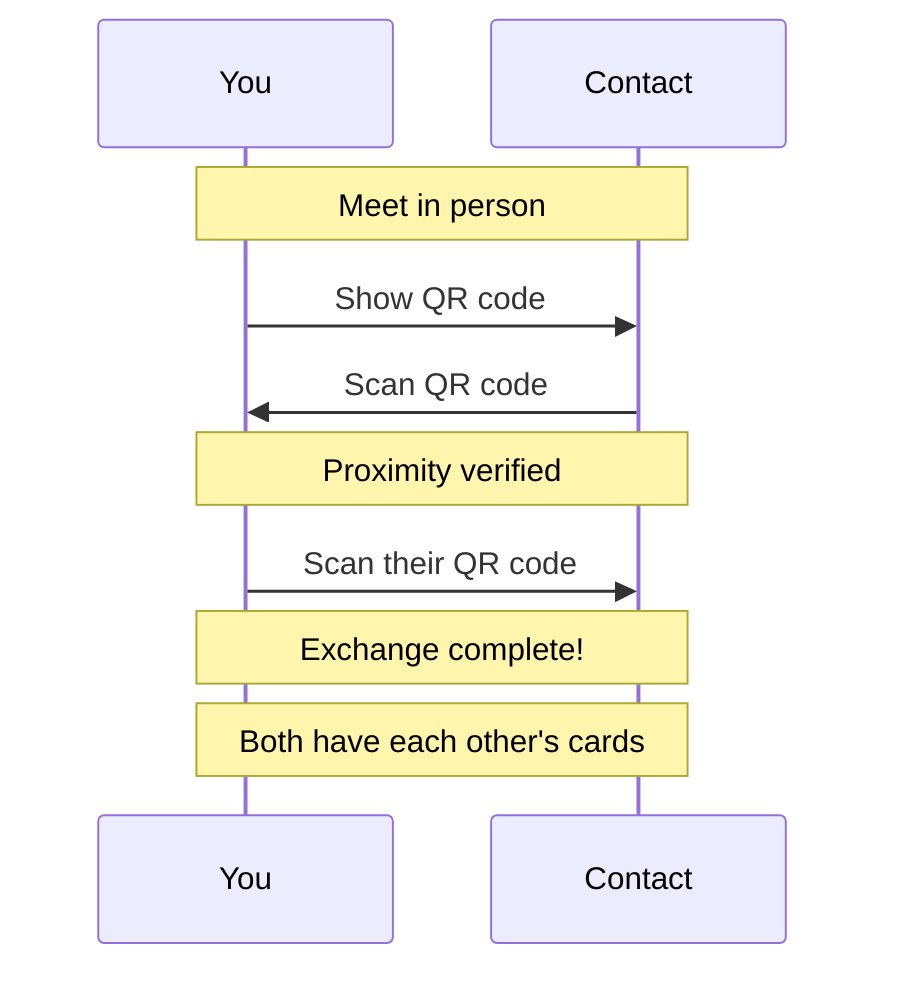

<!-- SPDX-FileCopyrightText: 2026 Mattia Egloff <mattia.egloff@pm.me> -->
<!-- SPDX-License-Identifier: GPL-3.0-or-later -->

# Contact Exchange

Adding a contact in Vauchi looks almost too simple — you hold up a code,
they scan it, done. The simplicity is the achievement. Underneath that
moment sits the thing every messaging app quietly struggles with: how do
you *know* the person you just connected with is really them, and that
nobody slipped into the middle? Vauchi's answer is wonderfully
low-tech — you were both there.

---

## How it works

The default exchange is a deliberate, two-way act between people in the
same place:

## Why in person?

Presence is a security feature you've trusted your whole life without
calling it one. Standing in front of someone does, for free, what
elaborate protocols strain to do:

| Threat | How being there defeats it |
|--------|----------------------------|
| Spam | Strangers can't add you from afar |
| Impersonation | You're looking at who you're connecting to |
| Man-in-the-middle | Devices talk directly; there's no middle |
| Screenshot scraping | Proximity is checked, not just a picture |

A connection you made in the room is one you *meant* to make. That
intention is exactly what spam, bots, and impostors can't reproduce.

## Ways to exchange

### QR code — the one to start with

Works on every device, every time:

1. Open the **Exchange** tab
2. Show your QR code
3. Have them scan it
4. Scan theirs
5. Connected

For security, a QR code expires after **5 minutes** — long enough to
introduce yourselves, short enough that a stale screenshot is worthless.

### And, when you need them, others

QR is the dependable default, but it isn't the only door. Depending on
your devices you may also exchange by **tapping phones together**,
**bumping** them, or — when you simply can't be in the same room — by
sharing a one-off **Link** (`vauchi://exchange?…`) that completes
remotely through the relay over the next few days. The in-person methods
give the strongest guarantee; Link mode trades a little of that for
reach. The full menu lives in the
[Exchange Contacts guide](../guides/exchange.md).

## Proximity verification

On iOS, Vauchi confirms you're actually together using sound your ears
can't hear:

- Both phones emit and listen for an ultrasonic handshake (18–20 kHz)
- Range: roughly 3 metres
- If it can't hear the other phone, it falls back to manual confirmation
- This is what stops someone exchanging with a *photo* of your code
  instead of you

(Android proximity verification is planned; on desktop and CLI/TUI you
simply confirm manually.)

### If proximity won't verify (iOS)

1. Check both phones have working speakers and microphones
2. Move closer — within 2–3 metres
3. Quieten the surroundings
4. Disable anything that hijacks audio
5. Try again, or just confirm manually when prompted

## After the exchange

The moment it completes:

- The new contact appears in your **Contacts** list
- You see the fields they chose to share
- They see the fields you chose to share
- From here on, both cards keep themselves up to date

## Security properties

| Property | Mechanism |
|----------|-----------|
| Proximity required | Ultrasonic handshake (iOS); manual confirm elsewhere |
| No man-in-the-middle | X3DH key agreement bound to identity keys |
| Forward secrecy | Ephemeral keys discarded after exchange |
| Replay prevention | One-time token, 5-minute expiry |
| Card authenticity | Ed25519 signature on every card |

## Related

- [How to Exchange Contacts](../guides/exchange.md) — step by step
- [Privacy Controls](privacy-controls.md) — deciding what they see
- [Encryption](encryption.md) — how the exchange is protected
