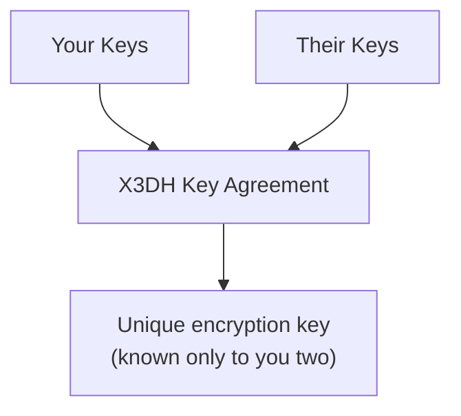

<!-- SPDX-FileCopyrightText: 2026 Mattia Egloff <mattia.egloff@pm.me> -->
<!-- SPDX-License-Identifier: GPL-3.0-or-later -->

# Encryption

There's a counterintuitive idea at the heart of Vauchi: the most useful
thing we can do with your data is arrange never to be able to read it.
Capability you don't have is liability you can't suffer — we can't lose,
leak, sell, or be compelled to hand over what we were never able to see.
Encryption is how that promise is kept by mathematics rather than by our
good intentions.

---

## What's encrypted

Everything. In every state it's ever in:

| Data | Encrypted? | Who can read it |
|------|------------|-----------------|
| Your contact card | Yes | You + your contacts |
| Messages between devices | Yes | Your devices only |
| Backup | Yes | You only (with your password) |
| Data at rest (on device) | Yes | You only |
| Data in transit | Yes | You + the recipient only |

## How it works

### Your identity

When you create your identity, your device generates:

- A **master seed** — 256 random bits, the root every other key grows
  from
- A **signing key** (Ed25519) — proves a message really came from you
- An **exchange key** (X25519) — strikes a shared secret with each
  contact

None of these ever leave your device in the clear.

### Exchanging contacts

When you exchange with someone, your two devices perform a small,
ancient piece of cryptographic theatre — agreeing on a secret in the
open that only the two of them end up knowing:

1. You scan their QR code (it carries their public key)
2. Both devices run **X3DH** key agreement
3. A shared secret emerges that only the two of you possess
4. Everything from then on is encrypted under it

### Updates between contacts

When you change your card:

1. The update is encrypted separately for each contact
2. Different people may receive different updates — that's your
   visibility settings doing their job
3. Each message uses a fresh, single-use key (forward secrecy)
4. The relay, as ever, sees only sealed blobs

### Forward secrecy

Vauchi uses the **Double Ratchet** protocol — the same mechanism behind
Signal. The idea is almost paranoid, in the good way:

- Every message gets its own key
- Each key is derived, used once, then destroyed
- Compromise one key and you've compromised exactly one message —
  never the conversation
- Today's keys cannot reach back and decrypt yesterday's messages

It treats every key as disposable, so that no single theft is ever worth
much.

## The algorithms

| Purpose | Algorithm | Notes |
|---------|-----------|-------|
| Signing | Ed25519 | Identity and authenticity |
| Key agreement | X25519 | Shared secrets |
| Symmetric encryption | XChaCha20-Poly1305 | All data |
| Key derivation | HKDF-SHA256 | Derives keys from seeds |
| Password KDF | Argon2id | Protects backups |

Nothing here is home-rolled. It's built on well-known, audited Rust
libraries. The signing and key-agreement crates (`ed25519-dalek`,
`x25519-dalek`) were professionally audited by Trail of Bits; the
encryption and KDF crates (`chacha20poly1305`, `argon2`) implement
IETF-standardised algorithms. In cryptography, *boring and reviewed*
beats *clever and new* every single time.

## What the relay server sees

The relay routes your messages and understands none of them:

| Relay sees | Relay cannot see |
|------------|------------------|
| Encrypted blobs | Message content |
| A daily-rotating routing token | A stable identity |
| Timestamps | What you changed |
| Padded message size | Who you are — or your IP |

Messages are padded to standard buckets (256 B, 512 B, 1 KB, 4 KB) so
even the *shape* of your traffic gives nothing away, and requests arrive
via an Oblivious HTTP gateway that strips your IP. The relay is told the
absolute minimum required to be a courier, and not one byte more.

## On your device

Your keys rest in whatever vault your operating system already trusts:

| Platform | Key storage |
|----------|-------------|
| iOS | Keychain |
| Android | KeyStore |
| macOS | Keychain |
| Windows | Credential Manager |
| Linux | Secret Service (where available) |

## Backups

A backup is encrypted with your password — and your password alone:

1. **Key stretch:** Argon2id, deliberately slow and memory-hungry, so
   brute force is expensive even with a fast machine
2. **Encryption:** XChaCha20-Poly1305
3. **Result:** without the password, the file is so much noise — to an
   attacker, and to us

Use a passphrase: four random words you'll remember beat a clever
squiggle you won't.

## Security properties, in one table

| Property | How it's achieved |
|----------|-------------------|
| **Confidentiality** | XChaCha20-Poly1305 |
| **Integrity** | AEAD authentication tags |
| **Authenticity** | Ed25519 signatures |
| **Forward secrecy** | Double Ratchet, one-time keys |
| **Break-in recovery** | DH ratchet, ephemeral keys |
| **Replay prevention** | Per-message nonces |
| **Traffic-analysis resistance** | Message padding + OHTTP |

## Don't take our word for it

All of this is open source. Read the implementation, check the claims,
report anything that smells wrong:
[gitlab.com/vauchi](https://gitlab.com/vauchi). "Verifiable" is a
stronger word than "trusted."

## What encryption can't do

Honesty matters more than reassurance, so: encryption protects the data,
not the laws of physics or human nature. It does **not** cover —

- **What you choose to reveal:** your name and the fields you make
  visible are visible on purpose
- **Physical access:** someone holding your unlocked device is past the
  cryptography
- **Screenshots:** a contact can photograph what you showed them
- **The brief window before secure delete finishes**

No tool removes the need for judgement. It just makes good judgement
sufficient.

## Related

- [Security Overview](../../about/security.md) — the broader picture
- [Cryptography Reference](../../developers/crypto.md) — every detail
- [Privacy Controls](privacy-controls.md) — deciding who sees what
