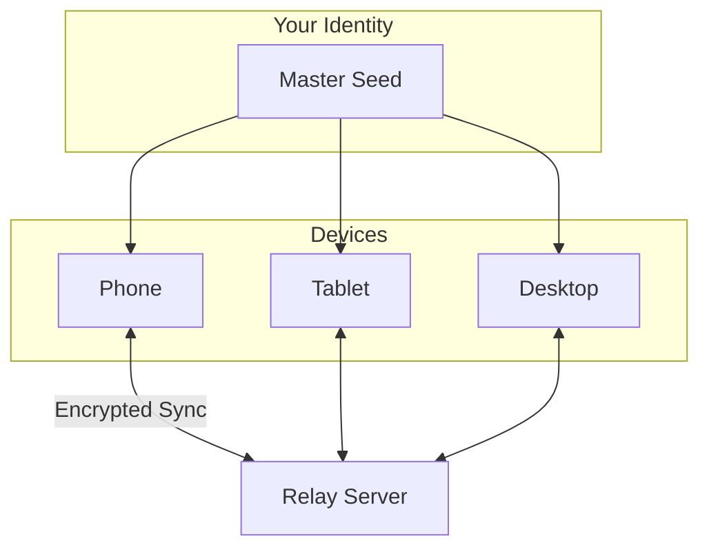

<!-- SPDX-FileCopyrightText: 2026 Mattia Egloff <mattia.egloff@pm.me> -->
<!-- SPDX-License-Identifier: GPL-3.0-or-later -->

# Multi-Device Sync

A single device holding your only identity is a single point of failure —
and single points of failure have a way of failing at the worst moment.
A second device changes the whole risk calculation: lose your phone and
it's an inconvenience, not a catastrophe. One identity, several windows
onto it, kept quietly in step.

---

## How it works

Every device you link shares the same identity. A change on one shows up
on all of them.



## Link a new device

**You'll need:** your existing device set up, the new device with Vauchi
installed, and both online.

1. On the **existing device**, go to **Settings > Devices**
2. Tap **Link New Device**
3. A QR code appears — valid for **5 minutes**
4. On the **new device**, install Vauchi
5. Choose **Join Existing Identity**
6. Scan the QR (or paste the data string on desktop/CLI)
7. Check the **confirmation code** matches on both screens
8. Confirm

Both devices now share your identity and sync on their own.

### The confirmation code

Both devices show a 6-digit code (e.g. `123-456`), derived
cryptographically from the shared link data — only the two devices in
the link can compute it. Matching codes mean nobody slipped into the
middle. It takes a second to check and closes the one gap a network
attacker might hope for; check it.

## How many devices

- **Maximum:** 10 per identity — more than most people own, few enough
  to keep the circle of trust small
- **Minimum:** 1

Need an 11th? Revoke one first.

## Platform support

| Platform | Link (generate) | Join (scan/paste) | Manage devices |
|----------|-----------------|-------------------|----------------|
| iOS | Planned | Planned | Planned |
| Android | Planned | Planned | Planned |
| Desktop | Yes | Yes (paste) | Yes |
| TUI | Yes | Planned | Yes |
| CLI | Yes | Yes | Yes |

## Managing devices

**See what's linked.** **Settings > Devices** lists every device — name,
platform, and status — with your current one marked.

**Revoke a device** that's lost, stolen, or retired:

1. On *another* linked device, go to **Settings > Devices**
2. Find the one to remove
3. Tap **Revoke** and confirm

```admonish warning
You can't revoke the device you're holding — use another linked device
to cut off a lost one. (Which is itself a quiet argument for having a
second device.)
```

A revoked device loses access instantly, can no longer send or receive
updates, and can't be re-linked without starting fresh.

## What syncs, and how

Changes sync automatically when you're online, end-to-end encrypted, with
the relay none the wiser. Offline changes catch up when you reconnect.

| Data | Syncs? |
|------|--------|
| Your contact card | Yes |
| Your contacts | Yes |
| Visibility settings | Yes |
| App preferences | Yes |
| Device-specific settings | No |

**Timing:** near-instant when both devices are online; a pull of anything
pending whenever you open the app; and a manual **Settings > Sync Now**
when you're impatient.

## Moving to a new phone

**Link it (recommended).** Link the new phone as a device, let it sync,
then optionally revoke the old one. This preserves each device's own keys
and hands over cleanly.

**Or restore from backup.** Create an encrypted backup on the old phone;
restore it on the new one. Ideal when the old phone is already gone.

## Troubleshooting

**Sync isn't working.** Check connectivity on both devices, make sure the
app is open on each, try a manual sync, and confirm the device wasn't
revoked.

**A device won't appear.** Give sync a few minutes, restart the app on
both ends, make sure the link code hasn't expired (5 minutes), and
generate a fresh one if needed.

## Security

- Each device holds its own keys, derived from your master seed
- Revoking a device invalidates its keys immediately
- The relay never sees plaintext
- Device-to-device traffic is end-to-end encrypted
- Confirmation codes block man-in-the-middle attempts during linking

## Related

- [How to Set Up Multi-Device](../guides/multi-device.md) — step by step
- [Backup & Recovery](backup-recovery.md) — the other way back in
- [Encryption](encryption.md) — how multi-device encryption works
